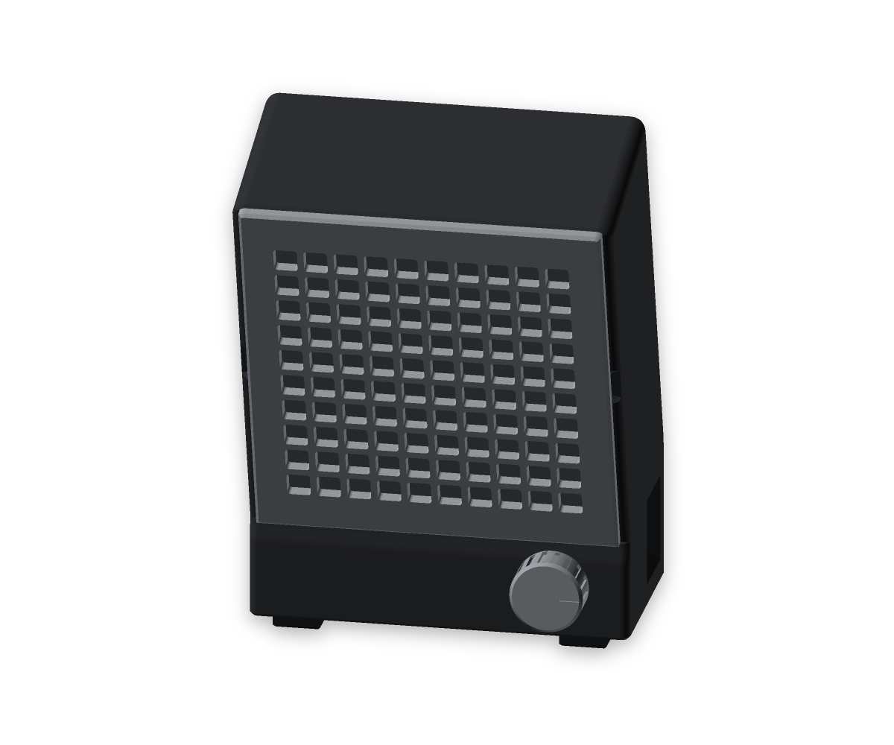
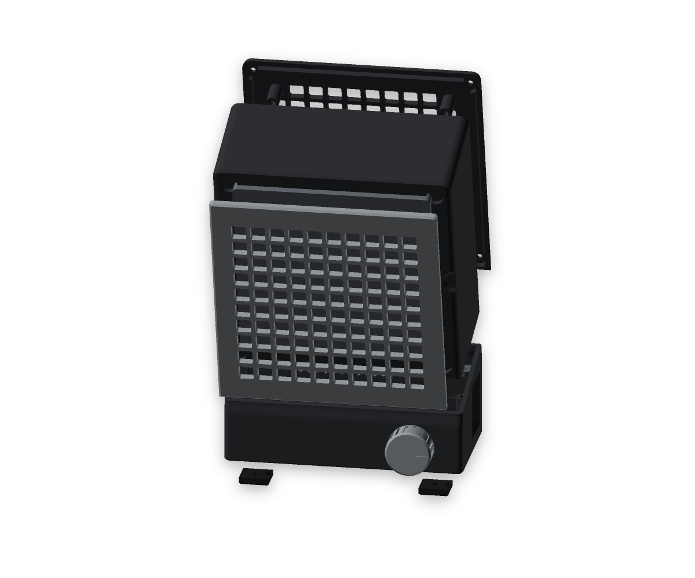
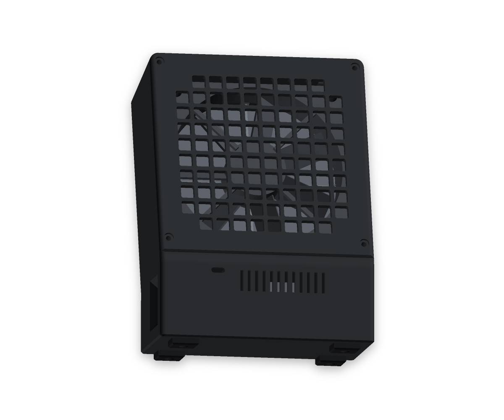
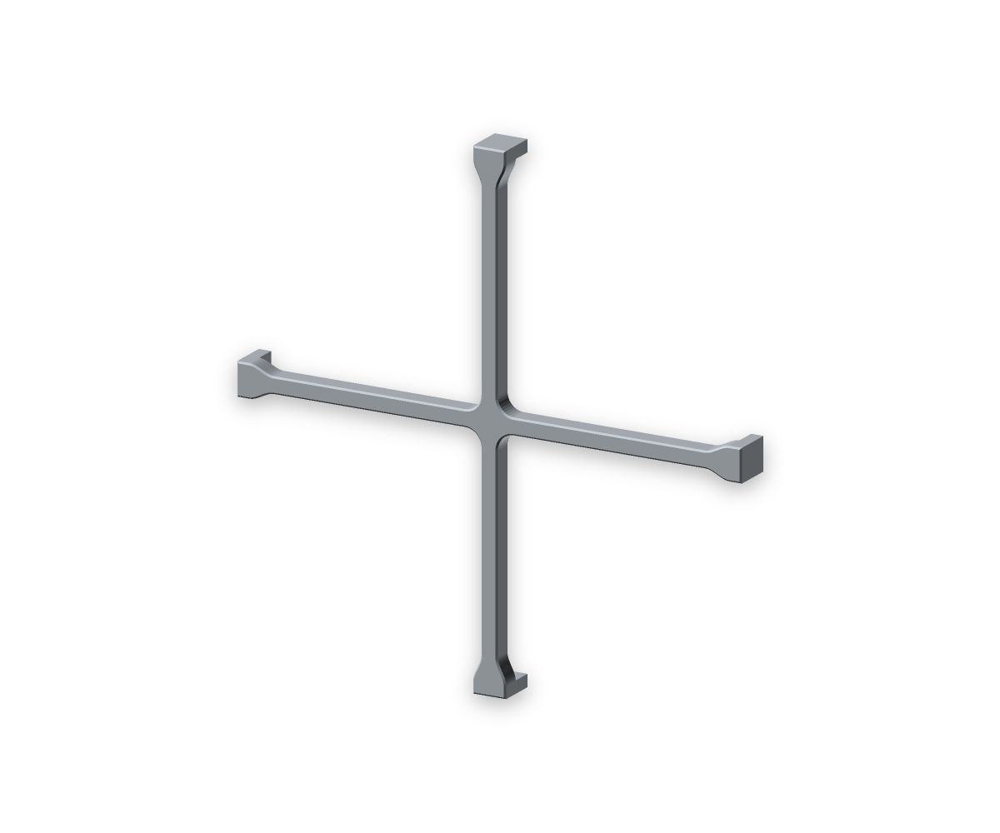
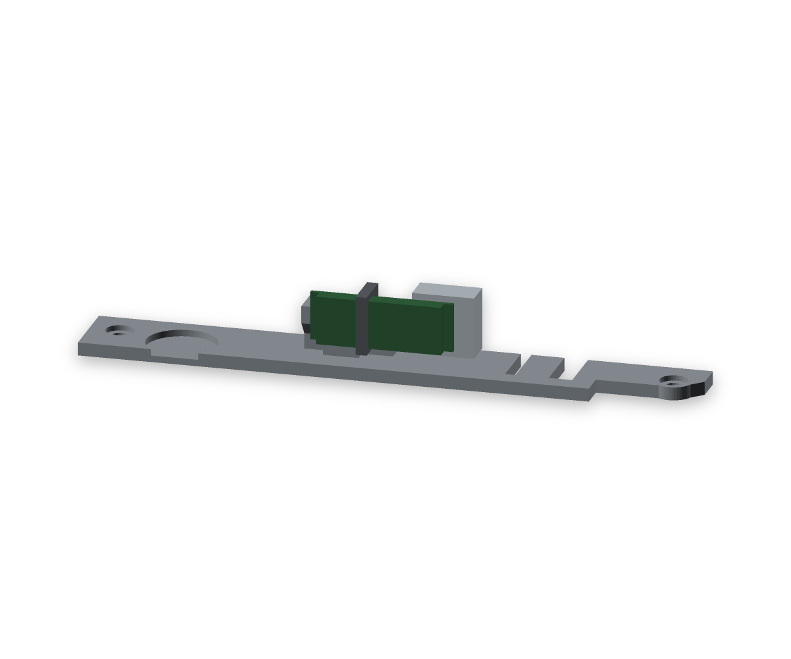
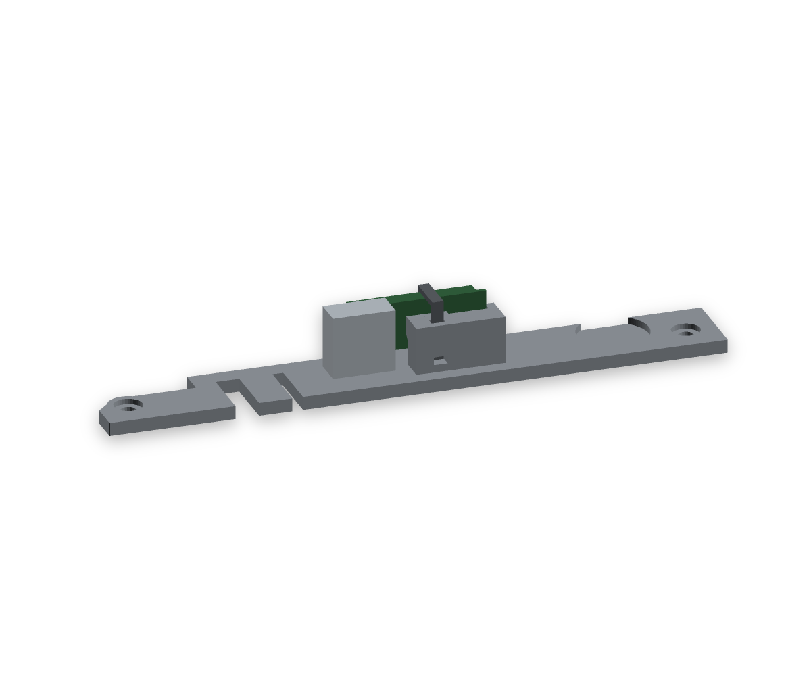
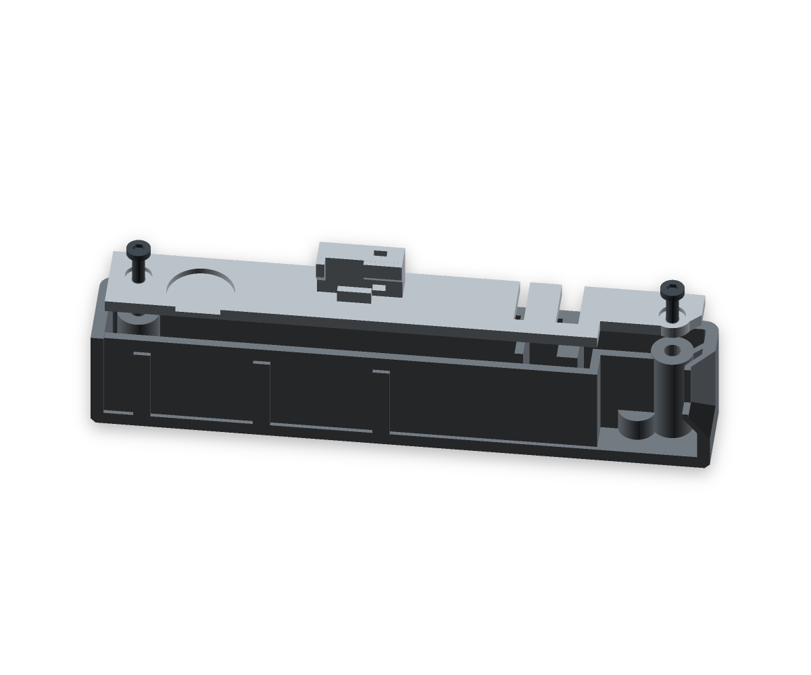
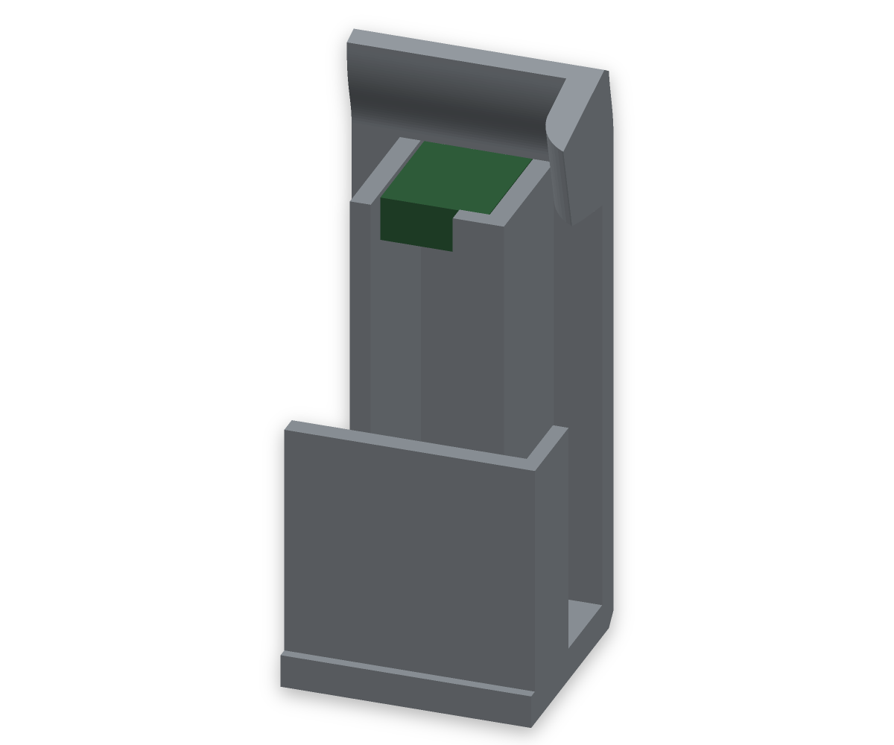

# FUMEX — a solder fume extractor that bends towards the work

A 120 mm PWM fan pulls the smoke off the soldering iron through a 120 × 120 × 17 mm filter mat and blows it out the back, away from you. The housing stands upright over its electronics bay and then bends 15° forward, so the intake face looks down at the joint instead of past it. Battery powered: a 3.2 V 6000 mAh LiFePO4 pack runs it for hours and charges over USB-C while the fan keeps going.

Designed for a Bambu Lab H2S with AMS in Bambu PETG black and grey. The electronics are the ones from [LEO-AC1](https://github.com/fhirschmann/leo-ac1); only the fan is different.



| Exploded | Back |
|:---:|:---:|
|  |  |

## How the air runs

```
grid of the cassette ─► mat 17 mm ─► support cross / throat 117 ─► fan 120 × 25 ─► plenum ─► slots in the back cover
```

The mat sits on the intake side, so flux resin settles in the fleece and the impeller stays clean. It is held by a continuous 2.25 mm lip around the 117 mm intake opening. A rear lip catches its edges, and a separate thin **support cross** behind the mat limits bowing towards the fan. Its two 2.4 mm wide bars leave four open fields about 57.3 mm across and cover about 4.1 % of the opening. The cross starts 2.3 mm behind the nominal mat rear face and is 3.2 mm deep, leaving 5 mm between its central bars and the fan frame's front plane. The soft mat and printed bars can still flex; check for rubbing at full speed with the actual mat fitted.



That rear lip is also the fan's seat: the filter tube ends as a ring the fan frame sits on. The support cross slides into four pockets from the back; posts on its ends are captured by the fan frame, so it needs no screws or glue. The fan is screwed to the **back cover** — four spacer posts on the cover carry its heat-set inserts, and the M3 × 30 go in from the front of the fan. Fan and cover are screwed together on the bench, where that face is reachable, and the pair goes into the head as one part. The four internal corner guides have 1.2 mm lead-in chamfers on both inner edges, widening the entry clearance to 1.6 mm per side before the straight 0.4 mm guides locate the frame.

The filter cassette is held by four magnet pairs and comes off by hand; two finger scoops in the side edges of the intake face give you something to pull against. It stands 4.5 mm proud of the intake face rather than sitting flush in it: letting it into the face would put a 5700 mm² horizontal ceiling over the chamber, and the head prints with that face on the bed. 4.5 mm is also as thin as it goes, because the magnet pockets are 3.2 mm deep and the minimum wall is 1.2 mm. A continuous 1.2 mm bevel round its finished contour leaves 3.3 mm of straight rim.

The charge module stands upright on the ballast lid at the back of the bay. A holder and one cable tie secure only its cool OUT end; the heatsink end stays free, with 4.7 mm between the printed holder and the heatsink. Its components face forwards and its heatsink faces the back wall, exposing both sides of the hot end to air. Six slots directly above it connect to the plenum behind the fan, with passages past the component side and the heatsink to the back-wall ventilation slots. This branch carries filtered air because it starts downstream of the mat. With the fan off, the same openings allow natural convection. Actual cooling must be checked with the assembled wiring and the housing closed.

| Component side | Heatsink side |
|:---:|:---:|
|  |  |

## Printed parts

Eight part types, eleven printed pieces including the four feet.

| Part | Qty | Material | Size (mm) | Print orientation |
|---|---|---|---|---|
| `head` fan and filter housing | 1 | PETG black | 145 × 145 × 70 | intake face on the bed |
| `base` electronics bay | 1 | PETG black | 145 × 74 × 57.3 | bottom on the bed, open at the top along the 15° joint plane |
| `head_back` back cover | 1 | PETG black | 145 × 144.7 × 18.3 | outside on the bed |
| `ball_lid` ballast lid | 1 | PETG black | 138.6 × 17.8 × 13.7 | flat on the bed |
| `filter_support` support cross | 1 | PETG black | 122 × 122 × 8 | mat-facing side on the bed, four posts upwards |
| `cassette` filter cassette | 1 | PETG grey | 138 × 143 × 4.5 | grid face on the bed |
| `knob` speed knob | 1 | PETG grey | Ø 28 × 13.5 | top on the bed |
| `foot` foot | 4 | TPU | 18 × 16 × 6.5 | ground face on the bed, 100 % infill |

All parts are in the Bambu Studio project [`stl/fumex_all_parts.3mf`](stl/fumex_all_parts.3mf): plate 1 head, ballast lid and support cross, plate 2 base and back cover, plate 3 grey parts, plate 4 TPU feet. Filaments: 1 PETG black, 2 PETG grey, 3 TPU. No part mixes colours, so there is no prime tower. Every part prints without supports. Bambu Studio estimates about **0.47 kg and 15.4 hours** for the four arranged plates (16.4 hours as individual part jobs; head 222 g, base 119 g, back cover 60 g, cassette 50 g, ballast lid 8 g, support cross 3 g, knob 6 g, feet 4 × 1.5 g).

Print profile: 0.20 mm layers, 4 walls, 5 top/bottom layers, 20 % gyroid (feet 100 %).

## Bought parts

| Part | Qty | Link | Notes |
|---|---|---|---|
| Fan ARCTIC P12 Pro (PST) | 1 | [arctic.de](https://www.arctic.de/en/P12-Pro-PST/ACFAN00306A) | 120 × 120 × 25 mm, 185 g, 600–3000 rpm, 131 m³/h, 6.9 mmH₂O, 12 V / 0.33 A, 0 rpm below 5 % PWM; pressure-optimised, which is what a filter mat needs. Blowing towards the back |
| Filter mat, 120 × 120 × 17 | 1 | – | cut from a cooker hood mat: white fleece plus a carbon layer. **Fleece side to the front**, carbon behind it |
| Battery 3.2 V 6000 mAh LiFePO4 pack with protection board (BMS), JST-PH 2.0 | 1 | [eremit.de](https://www.eremit.de/p/3-2v-6000mah-pack-mit-schutz-arduino-aio-jst-ph-2-0-stecker) | cell Ø 32.5 × 71.6 mm, lying across the bay, protection board up; charge only with a LiFePO4 charger (3.65 V), **no** TP4056 |
| Charge/boost module "2-in-1 3.2 V LiFePO4", **12 V variant** | 1 | [AliExpress](https://de.aliexpress.com/item/1005008094801881.html) | eletechsup LFUPSMA, board 32.2 × 11 × 1.0 mm; IN± 5 V charging, B± battery, O± 12 V. See the note on its 0.32 A rating below |
| Aluminium heatsink 14 × 14 × 6 mm with an insulating silicone thermal pad | 1 | – | on the metal pad behind the charger IC, facing the back-wall vents; the pad must cover the whole heatsink face |
| PWM fan controller CNY-FA5-PRO, DC 8–24 V, with potentiometer and switch | 1 | [AliExpress](https://de.aliexpress.com/item/1005010113177510.html) | 41 × 32 × 15 mm, flat in the bay, shaft through the front panel |
| USB-C PD trigger module, Type A (default 5 V) | 1 | [AliExpress](https://de.aliexpress.com/item/1005010610660644.html) | charging socket high in the back wall, above the ballast lid. **Leave pads 1–4 open** (they select 9/12/15/20 V); the charge module only takes 4–6 V, check 5 V with a multimeter before connecting |
| ON-OFF rocker switch, snap-in, 21 × 15 mm (cut-out 19.2 × 12.2 mm) | 1 | [AliExpress](https://de.aliexpress.com/item/1005008871215158.html) | in the right side wall, long side upright |
| LED 3 mm, breathing/fading, 3.3 V, water clear | 1 | [AliExpress](https://de.aliexpress.com/item/1005005336879647.html) | charge indicator beside the knob, fitted from inside behind a closed 0.8 mm front skin; check visibility through the chosen black PETG |
| Resistor 220 Ω, 1/4 W | 1 | – | series resistor for the LED on the 5 V USB input |
| Neodymium disc magnets Ø 10 × 3 | 8 | – | four pairs, glued into open pockets in the intake face and the cassette |
| Resettable PTC fuse Bourns MF-R160 or RXEF160 (1.6 A hold) | 1 | – | optional, between battery plus and the switch, in heat shrink |
| Heat-set inserts Ruthex RX-M3x5.7 | 16 | [ruthex.de](https://www.ruthex.de) | 4 fan, 4 back cover, 2 head screws, 4 feet, 2 ballast lid |
| M3 × 30, ISO 7380 Torx | 4 | – | fan to the back cover; the frame alone is 25 mm thick, so nothing shorter reaches a thread |
| M3 × 8, ISO 7380 Torx | 12 | – | back cover (4), head onto the base (2), feet (4), ballast lid (2) |
| Iron offcuts for the ballast | – | – | up to 41.0 cm³, about 193 g, loose in the trough under its lid |
| JST-PH 2.0 cable, 2-pin, mating the battery plug | 1 | – | battery to the switch and B+ / B− |
| Cable tie, 2.5 mm wide × 1.2 mm thick | 1 | – | secures the charge module at its cool OUT end |
| Silicone wire 24 AWG, red and black | about 1 m | – | USB-C module, switch, LED, 12 V to the PWM controller |
| Heat-shrink tubing 2–3 mm | – | – | every solder joint |
| Foam tape, self-adhesive, 1–2 mm | – | – | a strip above and below the cell keeps it from rattling |

## Wiring

```
USB-C PD trigger 5 V ─┬──► IN+ / IN−   charge/boost module (12 V) ──► O+ / O− 12 V ──► PWM controller ──► 4-pin fan
                      └──► 220 Ω ──► LED ──► IN−
battery (JST-PH, built-in BMS) ──► (PTC) ──► rocker switch ──► B+ / B−
```

- The module charges the battery with up to 1 A and delivers 12 V at the same time, so the fan keeps running while it charges. Use a USB power supply with at least 2 A.
- With the switch in the battery line, off really disconnects the battery, and the battery only charges with the switch on. To charge without the fan running, turn the knob down until it clicks.
- The LED shows that the charging cable is plugged in, not the charge state.
- **Start slow.** The module is specified for 0–0.32 A at 12 V and the P12 Pro draws 0.33 A at full speed, so the top of the knob range sits right at its limit: it gets warm there, and switching on at 100 % may brown out. Turn the knob up once the fan is running. At half speed the pack lasts far longer than the roughly four hours it manages flat out.
- The CN3058E on the module is a linear charger: at 1 A from 5 V it turns about 1.6 W into heat while the battery charges. The upright board exposes its components at the front and its heatsink at the back to the passages between the head-floor slots and the back-wall vents. Keep wires clear of both sides and check temperatures in the closed housing while charging, with the fan running and stopped.
- If that is still not cool enough for your taste, replace the ISET resistor (marked 122, 1.2 kΩ) with 2.4 kΩ: half the charge current, half the heat, and 12–13 hours for a full charge.

## Assembly

1. Press in the 16 heat-set inserts: 4 into the spacer posts of the back cover from the fan side, 4 into the bosses along the head's side walls from the back, 2 into the bosses under the base rim, 4 into the base floor from below, and 2 into the ballast-lid posts from above.
2. Glue the magnets: four into the pockets of the intake face first, then put the other four on top of them, drop the cassette on and glue those into the cassette. The polarity then cannot be wrong.
3. Slide the support cross into the head from the open back, with its flat crossed face towards the mat and its four posts towards the fan. Its widened ends fit the four rear-open pockets in the filter tube. No screws or glue are needed.
4. Lay the back cover on the bench, set the fan on its four posts **blowing towards the cover**, so it pushes the air out through its grid, and screw it down with M3 × 30 from the front of the fan. The cable comes out on the side that will face the head floor.
5. Fit the electronics in the base: PWM controller flat on its rib pads with the potentiometer through the front wall, washer and nut from outside; LED glued into its blind pocket from inside, with its flange against the rear of the boss and the front skin intact; USB-C module into its channel in the back wall; rocker switch snapped into the right wall. The USB-C channel rests on two vertical ribs from the trough floor and opens into the bay at the wire end; seat the board against its side stop and route the wires through the open end. Keep wires clear of the lid and switch recess.
6. Stick the insulating pad onto the metal pad on the back of the charge module and the heatsink onto the pad. Set the board's cool OUT end into the holder on the ballast lid, against its end, bottom and rear supports; components face forwards and the heatsink faces the back wall. Secure it with one 2.5 × 1.2 mm cable tie through the holder and around the board, 11.25–13.75 mm from the OUT end. Check the tie against the actual components and solder joints before tightening. Leave the heatsink end free, leave slack in the wires and keep the air passages open. Cut and replace the tie when removing the board.
7. Fill the ballast trough behind the battery with iron offcuts — up to about 193 g — and fit the lid around the USB support ribs using its rear-open slots. Fasten it with two M3 × 8, one at each end, into the heat-set inserts. The wider switch recess leaves 5.5 mm in front of the terminals, about 2 mm at the closest point of the switch body and 2.4 mm between the switch and lid. Fill it properly or pack the rest with foam; loose pieces under a half-empty lid rattle.
8. Lay the battery into its three saddles, protection board up, cable end to the right, a strip of foam tape above and below.
9. Put a drop of CA gel into the knob bore and push the knob onto the shaft until it bottoms; it then stands 1.2 mm off the wall and turns freely.
10. Set the head onto the base and screw it down with 2 × M3 × 8, reaching in through the open back: they sit in the head floor just behind the fan, the one place inside the head where a driver gets to the rim. Then lower the fan-and-cover assembly in from the back — the corner guides in the head take it onto its seat — and check that the actual fan frame captures all four support-cross posts. Screw the cover down with 4 × M3 × 8.
11. Screw the four TPU feet on from below with M3 × 8; the small peg beside each screw stops them turning.
12. Push the mat in past the lip so the white fleece ends up facing **forwards**, towards the cassette, and the dark carbon layer faces the fan. Then put the cassette on.

| Two lid screws, lifted for clarity | USB-C mount, cutaway |
|:---:|:---:|
|  |  |

To change the mat: pull the cassette off using its side scoops, pinch the flexible mat and pull it past the retaining lip, then press the new one in.

## Design notes

- The base has a 145 × 74 mm footprint. Its upper 8 mm curve inwards to meet the projected outline of the head at the 15° joint, so the head closes the electronics bay without a separate cover or a projecting base lip. The 145 mm width comes from the magnet pockets in the intake face.
- The head leans forward, so the centre of mass moves towards the front feet. The model computes it from the part masses and checks that it stays at least 15 mm inside the foot polygon: 28.6 mm at the front, which is 21.3° of tip angle at 1.01 kg. That angle is measured from the sole of the feet and against the contact patch the pads' bottom chamfer actually leaves, not against their full outline. The ballast does most of that work — the cell sits well forward so everything behind it is one trough across the full width, 41.0 cm³ or about 193 g of iron offcuts under a screwed lid, with the USB-C socket above it.
- **Filling the ballast:** only behind the cell, never in front of it — mass ahead of the centre of mass makes tipping worse, and the large free space at the front is exactly the wrong place. The screwed lid keeps the loose pieces away from the wiring. Two M3 × 8 screws at the left and right ends engage heat-set inserts in the printed posts.
- Walls 3 mm, base floor 3.2 mm, back cover 4 mm. Corner radius 6 mm at the top of the head, 3.5 mm on the four vertical edges, and 0.5 mm where head and base meet — the joint is a straight parting line that runs into the rounded vertical edge, and that edge carries the corner. A larger radius there put two different arcs plus the chamfers around the joint into the same corner, which looked like a jumble. The plan and elevation radii blend smoothly at the four upper corners. The base rim follows the tilted head contour around the joint; the deliberate 15° bend and rear edge chamfers remain. 3.5 mm is the most the magnet pockets in the intake face allow: at 6 they would fall outside the rounded corner, and they cannot move further in without reaching the intake opening.
- The joint plane rises 15° towards the back, so it meets the vertical back face of the base at 75°. That edge — the one the back cover lands on — is chamfered at 45°, as is the lower edge of the cover itself, and the two form one groove instead of a sharp rim.
- The head is located on the base by two screws in one row behind the fan; there is no register, and the outer contours match. That row is also where the load is: the head leans forward, so its centre of mass sits 22 mm in front of the joint, pressing the front of the joint together and lifting the back. Every screw in the design is checked for driver access — a bit and its holder are modelled on each screw head and must not touch anything. 
- The mat is 17 mm of soft fleece, so it seals against the chamber walls: everything downstream of it is filtered air.
- The LED pocket is Ø3.2 mm and stops 0.8 mm behind the closed front surface. Its flange rests on the boss inside the housing. This thin light window is deliberate; leave it closed and check the LED's visibility through the printed material.
- PETG softens well below a soldering iron. Keep the tip away from the housing.

## Build from source

Model: [`fumex.scad`](fumex.scad) (OpenSCAD, parameters at the top), project settings and checks: [`print_project.py`](print_project.py). The scripts in `scripts/` export and check the meshes, slice with the Bambu Studio CLI and build the 3D assembly viewer. [BOSL2](https://github.com/BelfrySCAD/BOSL2) supplies the edge profiles and is pinned as the `BOSL2/` Git submodule; initialise it before opening the model in OpenSCAD or running the tools.

```sh
git submodule update --init --recursive          # pinned BOSL2 geometry library
python3 -m venv .venv
.venv/bin/python -m pip install -r scripts/requirements.txt
.venv/bin/python scripts/print_tools.py export     # export and check stl/, asm/, docs/verification.json
.venv/bin/python scripts/analyze.py islands        # floating regions
.venv/bin/python scripts/analyze.py overhangs      # unsupported faces
.venv/bin/python scripts/analyze.py thickness      # walls thinner than 1.2 mm
.venv/bin/python scripts/analyze.py fins           # slender towers with a free tip
.venv/bin/python scripts/slice_check.py            # Bambu Studio CLI, project 3MF
.venv/bin/python scripts/build_viewer.py --copy-to docs/index.html   # viewer page
.venv/bin/python scripts/render_views.py           # img/, transparent PNGs
```

The fan in the model and the viewer is a simple parametric placeholder; no manufacturer CAD is used or needed.

## Licence

Model, printable files, images and documentation: [CC BY-NC-SA 4.0](LICENSE). Scripts in `scripts/`: [MIT](LICENSE-MIT). The BOSL2 submodule retains its own [BSD-2-Clause licence](BOSL2/LICENSE).
