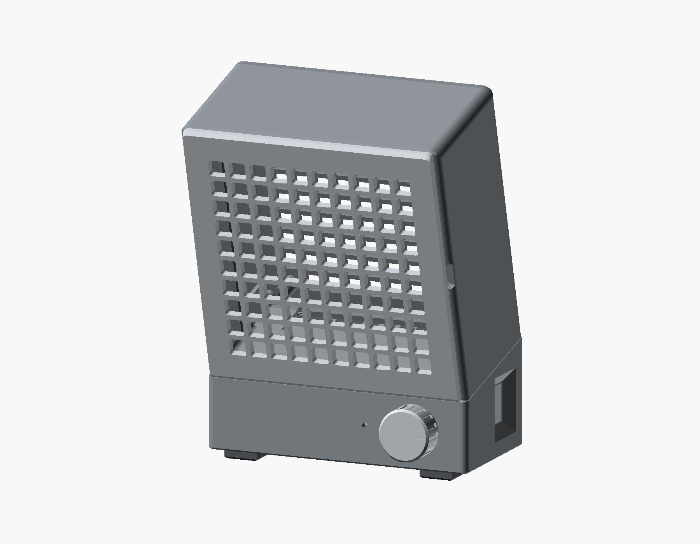
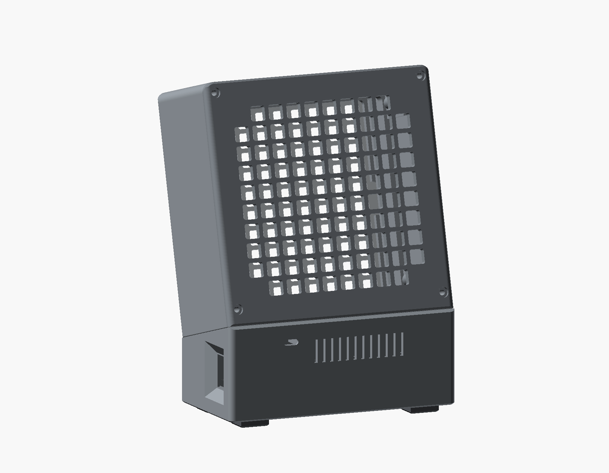

# FUMEX – vollständiges Projektaudit

Stand: 23. September 2026 · geprüfter Commit: `a90c581` · Modell unverändert.

Nachtrag: Die ursprünglichen Befunde bleiben hier als Prüfstand erhalten. Die anschließenden Korrekturen sind in `AGENTS.md` dokumentiert; für G2 und G3 siehe [Nachprüfung der Rundungen und Sockelfuge](rounding-2026-09-23.md).

**Urteil: Die Grundkonstruktion ist plausibel und digital gut druckbar. Eine uneingeschränkte Aussage „alles montierbar, bündig und durchgehend gerundet“ ist derzeit nicht gerechtfertigt.** Es gibt konkrete Befestigungs- und Montageprobleme, eine offene Stelle im Ballastbehälter und echte Formkanten. Die vorhandenen Prüfungen laufen trotzdem durch, weil sie diese Eigenschaften teilweise nicht prüfen oder einen älteren Montageablauf abbilden.

Das Audit umfasst Quellcode, frisch erzeugte Netze, vorhandene Druckdateien, Slicerprofile, Stückliste, Montageanleitung, Werkzeugzugang, Bewegungswege, Stabilitätsrechnung und helle Render-/Schnittansichten. Es enthält keine Änderungen am Modell und keinen physischen Druckversuch. Gemeinsame Hardwaremaße wurden gegen die Messnotizen von LEO-AC1 betrachtet; eine vereinfachte Hardwarehülle ersetzt keine Passprobe am realen Teil.

## 1. Wichtigste Befunde

P1: vor Aufbau/Betrieb beheben. P2: vor dem endgültigen Komplettdruck klären oder korrigieren. P3: Dokumentation beziehungsweise Detailqualität nachziehen.

| ID | Priorität | Befund | Nachweis |
|---|---|---|---|
| A1 | P1 | Die Schalter-Aussparung im Ballastdeckel öffnet die Metallwanne zur Elektronik. | Freier Durchlass mindestens 9 × 3,5 mm. |
| A2 | P1 | USB-C-Platine kann beim Einstecken nach innen geschoben werden. | 15 mm kollisionsfreier Weg; kein innerer Anschlag/Clip. |
| A3 | P1 | Montageanleitung nennt die falsche Lüfterrichtung. | „Away from the cover“ kehrt den vorgesehenen Luftstrom um. |
| A4 | P2 | Der beschriebene gerade Einschub der Ladeplatine funktioniert mit der modellierten Bauteilhülle nicht. | Kollision mit Endauflage; vertikaler Ausbau kollidiert mit Haltenase. |
| A5 | P2 | Ballastdeckel: M3 × 12 reicht tiefer als das Kernloch; unter den Köpfen bleiben nur 1,1 mm. | 10,9 mm Eingriff bei 10 mm Lochtiefe; `thickness CLEAN` übersieht den Ring. |
| G1 | P2 | Die seitliche Kassettenfase wird abgeschnitten. | Lange Seiten bleiben über volle 4,5 mm scharfkantig. |
| G2 | P2 | Obere Kopfecken sind keine durchgehenden räumlichen Rundungen. | R3,5 und R6 schneiden sich mit deutlichem Normalensprung. |
| G3 | P2 | Gleicher lokaler Grundriss garantiert keine bündige Kopf-/Basisfuge. | Kippen verändert den Schnittgrundriss; sichtbare hintere Basislippe. |
| S1 | P2 | Kippwinkel überschätzt die Stabilität. | Fußhöhe und kleinere Aufstandsfläche fehlen; korrigiert etwa 21,6° statt 23,5°. |
| V1 | P2 | Montageprüfungen und offene Punkte bilden den aktuellen Aufbau unvollständig ab. | Falsche bewegte Gruppen, fehlende Befestigungen und Passtests. |
| D1 | P3 | README/AGENTS enthalten zahlreiche überholte Maße und Aussagen. | Inserts, Bauteilgrößen, Radien, Ballast, Prüfzahlen, Filterorientierung. |

## 2. Geometrie und ästhetische Wirkung

### Gesamtform

Die ruhige, funktionale Form passt zu einem Werkbankgerät. Der stehende Sockel, der nach vorn geneigte Kopf und die unten angeordnete Bedienung ergeben eine verständliche Gliederung. Kassetten- und Abluftgitter sprechen dieselbe Formensprache. Die Füße stehen innerhalb der Gehäusesilhouette; der seitlich versenkte Schalter und der große Knopf sind nachvollziehbare Funktionsdetails. Zusätzliche dekorative Elemente sind nicht erforderlich.

Die helle Darstellung dient der Formprüfung; sie ist keine Änderung der Filamentfarben. Die Render zeigen die gedruckten Teile ohne Hardware, damit die Konturen sichtbar bleiben.

| Vorderansicht | Rückansicht |
|---|---|
|  |  |

Die problematischen Stellen liegen in der Umsetzung der Übergänge, nicht in der grundsätzlichen Proportionierung.

### G1 – Kassette: seitliche Fase fehlt tatsächlich

`cassette_body()` erzeugt zunächst eine 2-mm-Randfase. Anschließend schneidet `cassette_raw()` das gesamte Teil mit `cass_prism()`. Dessen nach vorn verlängerte Fläche beginnt bei `x = plan_r = 3,5` und endet bei `141,5`. Selbst die vorderste ursprüngliche Fasenkontur beginnt bereits bei `x = cass_inset + cass_c = 3,0`; der spätere Schnitt liegt weiter innen und entfernt daher die seitliche Fase vollständig.

Ergebnis: tatsächliche Breite **138 mm**, an beiden langen Seiten eine senkrechte Wand über **volle 4,5 mm** bis zur Vorderfläche. Die README-Aussage einer umlaufenden Fase mit nur 2,5 mm sichtbarer Stufe trifft dort nicht zu. Das ist eine echte modellierte Kante, kein Beleuchtungsfehler.

Beleg: `fumex.scad:364–366`, `:567–575`; [Querschnitt der Kassette](audit-2026-09-23/cassette_side_bevel.png).

**Empfehlung:** Die Fase aus der endgültigen Kassettenkontur ableiten. Anschließend Magnetabstand und verbleibende Haut erneut prüfen; die bisherige Magnetbedingung allein belegt die fertige Außenkante nicht.

### G2 – Obere Kopfecken: Schnitt zweier Radien erzeugt eine Formkante

Der Kopf ist der Schnitt eines im Grundriss gerundeten Prismas mit einer im Aufriss gerundeten Hülle: **R3,5 in XY**, **R6 in XZ**. Zwei separat gerundete Profile ergeben durch ihre Schnittmenge keinen tangentialen räumlichen Eckübergang.

Analytisches Beispiel im ungedrehten Kopfsystem: ungefähr `x = 0,5`, `y = 1,6972`, `z = 189,3979`. Die beiden Flächennormalen unterscheiden sich dort um **38,21°**. Der Punkt liegt hinter der 1,2-mm-Frontfase. Im STL finden sich an derselben Ecke entsprechende Sprünge von etwa **34–44°** zwischen benachbarten Außenflächen. Diese diagonale Kante bleibt auch bei feinerer Tessellierung bestehen.

Beleg: `fumex.scad:360–363`, `:377–383`, `:413`; [Detail der oberen Ecke](audit-2026-09-23/head_top_corner_close.png).

**Empfehlung:** Wenn die Ecke wirklich weich durchlaufen soll, einen gemeinsamen räumlichen Übergang konstruieren. Bloß `$fn` zu erhöhen löst diesen Befund nicht. Die vorhandene Begrenzung durch Magnettaschen und Wandstärke bleibt dabei maßgeblich.

### G3 – Fuge zwischen Kopf und Basis: bündig nur in Teilbereichen

`plan_prism()` verwendet den Basisgrundriss im **lokalen Kopfsystem**; anschließend kippt `head_at()` diesen um 15°. Die Basis bleibt senkrecht. Damit sind die Grundrisse an der Fugenebene nicht identisch.

Ohne Randfasen liegt die vordere/hintere Kopfkante an der Fuge in Weltkoordinaten jeweils rund **1,261 mm innerhalb** der senkrechten Basisaußenfläche: `37 × (1 − cos 15°)`. Im lokalen Kopfsystem reicht der Schnitt der Basis dagegen bis ungefähr `y = −1,305` beziehungsweise `75,305`, während der Kopf auf `0…74` begrenzt ist. Fasen verändern den sichtbaren Verlauf zusätzlich; die genannte Zahl ist deshalb die Grundrissabweichung, kein überall gleich breiter sichtbarer Absatz.

Der [Schnitt hinten](audit-2026-09-23/rear_joint.png) und die [Seitenansicht](audit-2026-09-23/side.png) zeigen die verbleibende Basislippe. Die absichtliche 0,3-mm-Deckelfuge und ihre Fasen sind sinnvoll, begründen aber nicht die Aussage, alle Außenkonturen liefen stufenlos durch.

Beleg: `fumex.scad:355`, `:360–363`, `:413`, `:516–558`.

**Empfehlung:** Gewünschte Fugenkontur in einem gemeinsamen Koordinatensystem definieren und daraus beide anschließenden Teile ableiten. Die sichtbare Trennfuge darf bleiben; die Außenkontur sollte unabhängig davon geprüft werden.

### Kleiner Halsradius und bewusst sichtbare Kanten

Der kleine Übergang an der Seitenwand ist ebenfalls nicht überall glatt: `joint_neck()` lässt den R1-Auslauf die senkrechte Basiswand schneiden, statt dort tangential einzulaufen. Im exportierten Mittelschnitt ist der untere Abschnitt eine einzelne Gerade von ungefähr `(x=0, z=47,8532)` nach `(0,5, 48)`. Der R0,5 darüber besteht unter `$fs = 0,6` nur aus zwei Facetten. Die vergrößerte [Schnittansicht](audit-2026-09-23/side_neck.png) belegt das. Wegen der kleinen Abmessung ist dies ein Detailbefund; die fehlende Tangentialität und die grobe Auflösung sind zwei verschiedene Ursachen.

Die aufgesetzte Filterkassette, die hintere Deckelfuge, die Bodenfasen, Griffmulden und Knopfriffelung sind hingegen bewusste Funktionsdetails. Eine sichtbar abgesetzte Kassette ist gestalterisch vertretbar. Es ist nicht erforderlich, alle funktionalen Kanten in große Radien umzuwandeln.

## 3. Montage, Befestigung und Wartung

### A1 – Ballastbehälter ist an der Schalterausnehmung offen

Die rechte Aussparung des Deckels reicht von etwa `x=129…143`, `y=52…63`. Der zurückgesetzte Wanneninnenraum beginnt dort bereits bei `y=59`. Somit entfernt der Deckelausschnitt auch Abdeckung über tatsächlich vorhandenem Ballastvolumen.

Ein Prüfquader bei `x=129,1…138,1`, `y=59,25…62,75`, `z=25…31` überschneidet das Ballastvolumen um **31,5 mm³**, aber weder Basis, Deckel, Schalter noch Ladeelektronik. Er belegt eine mindestens **9 × 3,5 mm große offene Verbindung** vom Metallinhalt in den Elektronikraum. Ob ein bestimmtes verwendetes Reststück hindurchpasst, hängt von dessen Abmessungen ab; die behauptete vollständige Rückhaltung ist geometrisch widerlegt.

Zusätzlich bleibt durch `ball_rim=0,4` ein schmaler Spalt zwischen Wannenwand und Deckel. Dieser ist bei groben Stücken wesentlich weniger kritisch, hält aber feine Metallspäne nicht zurück.

Beleg: `fumex.scad:211–223`, `:678–683`, `:698–705`, `:717–721`.

**Empfehlung:** Wannenbegrenzung und Aussparung aufeinander abstimmen oder den Ballast separat geschlossen einschließen. Der Schalter muss dabei weiterhin montierbar bleiben.

### A2 – USB-C-Platine hat keine Sicherung gegen Einsteckkraft

Der Kanal positioniert die Platine seitlich und unterhalb, besitzt aber nach innen keinen formschlüssigen Anschlag. Der Körper `usbc` lässt sich **15 mm nach innen** bewegen, ohne Basis, Kopf, Akku, PWM-Platine, Schalter, Deckel oder Ladeelektronik zu schneiden. Die Kabelbinder halten die Leitungen, nicht nachweisbar die Platine selbst. Eine zusätzliche Fixierung wird in der Montageanleitung nicht verlangt.

Damit kann ein eingestecktes Kabel die Platine in das Gehäuse schieben. Ein kollisionsfreier Endzustand ist hier gerade kein Befestigungsnachweis.

Beleg: `fumex.scad:649–665`, `:842–844`; `README.md:90`.

**Empfehlung:** Zugänglichen Anschlag/Clip vorsehen oder eine konkrete, belastbare Fixierung festlegen. Anschließend Einstecken und Abziehen am realen Modul prüfen.

### A3 – Lüfterrichtung und Filterorientierung in der Anleitung korrigieren

`README.md:89` fordert einen Lüfter, der vom Deckel weg bläst. Für den beschriebenen Aufbau muss er **zur Rückwand hin und durch deren Gitter hinaus** blasen. Das ist funktional relevant, insbesondere für die vorgesehene Kühlung der Ladeplatine aus dem Plenum.

`README.md:97` verlangt außerdem, die Matte mit der Vliesseite zuerst hineinzuschieben. Beim Einführen von vorn landet diese Seite hinten. Die Stückliste verlangt dagegen zutreffend **Vlies nach vorn, Kohleschicht nach hinten**. Eine eindeutige Endlagenbeschreibung ist besser als „Seite zuerst“.

### A4 – Ladeplatine: dokumentierter gerader Montageweg kollidiert

Der linke Halter besitzt eine Nase über der Platine. Daher kollidiert ein vertikales Anheben der Ladebaugruppe bereits nach **0,25 mm** mit dem Ballastdeckel. Der derzeitige `chg_off`-Test übersieht dies, weil er den Deckel nicht als Hindernis enthält.

Auch der in `README.md:91` beschriebene gerade seitliche Einschub von rechts ist für die aktuelle Hülle nicht frei: Beim entsprechenden Auszug schneiden die nach unten ragenden Bauteile die rechte Endauflage; erste Kollision nach **0,25 mm**, im untersuchten Verlauf bis etwa **59,1 mm³**.

Das beweist einen Fehler der beschriebenen geraden Bewegung, **nicht**, dass jede schräge oder elastische Montage unmöglich wäre. Ein solcher anderer Weg ist gegenwärtig nicht belegt.

Beleg: `fumex.scad:485–501`, `:834–841`; `print_project.py:153–164`.

Hinzu kommt eine Lücke der Hardwarehülle: Sie behandelt die letzten 2 mm an beiden Platinenenden als bauteilfrei. Die LEO-AC1-Notizen zur Platinenbelegung nennen am OUT-Ende dagegen Lötpads samt Kabeln in beiden Ecken auf den ersten 0–2,8 mm, aus Fotos mit etwa ±0,3 mm abgeleitet. Die tatsächlichen Lötstellen und ihre Kabelrichtung müssen gegenüber der Endauflage freigestellt werden; die momentane Hülle kann diesen Kontakt nicht erkennen.

**Empfehlung:** Entweder Halter für einen tatsächlich freien Weg ändern oder die schräge Montage am realen Modul durchführen und genau beschreiben. Kontakt mit bestückten Platinenflächen darf dabei nicht als elastische Reserve angesetzt werden.

### A5 – Ballastdeckel: Schraubenlänge, Kopftasche und Prüfmodell passen nicht zusammen

Die Deckelplatte ist 3 mm dick, die Kopftasche 1,9 mm tief. Der Schraubenkopf trägt deshalb auf einem nur **1,1 mm dicken Ring**; dessen radiale Breite beträgt `(6,4 − 3,4)/2 = 1,5 mm`. Die 1,1 mm wurden an allen vier Taschen am STL bestätigt. Sie liegen unter der projektweiten 1,2-mm-Richtgröße, und genau dort wirkt die Klemmkraft.

Eine M3 × 12 reicht ab dieser Auflage **10,9 mm** in den Pfosten. Das vorgeformte Kernloch ist nur **10 mm** tief. Die Spitze muss somit etwa **0,9 mm in ungebohrtes Material** vordringen, bevor der Kopf vollständig sitzt. Ohne konkrete Schraubengeometrie ist das kein verlässlicher Schraubanschlag. M3 × 10 oder ein ausreichend tieferes Kernloch sind mögliche Korrekturen, jeweils passend zur echten gewählten Kunststoffschraube.

Die vier Deckelschrauben fehlen als Körper in `ASSEMBLY`; nur ihre Werkzeuge werden modelliert. Deshalb kann die Baugruppenprüfung diese Längenkollision nicht finden.

Warum `thickness CLEAN`? Der dünne Ring liegt vollständig innerhalb des voreingestellten 2-mm-Ausschlussbereichs um scharfe konvexe Kanten. Der Bericht enthält zwar `p01=1,1 mm`, meldet aber keine Region. Ohne diesen Kantenausschluss erscheinen die Taschen als dünne Bereiche. Dies ist eine konkrete Abdeckungslücke, kein Beleg für eine überall eingehaltene Mindestwandstärke.

Beleg: `fumex.scad:218`, `:225–226`, `:686–709`, `:884`; `scripts/analyze.py:164–171`.

### Was an der Montage nachvollziehbar funktioniert

| Bereich | Ergebnis und Grenze |
|---|---|
| Lüfter an Rückwand | Vier Ø8-mm-Pfosten, 14,3 mm lang; Ø4 × 7-mm-Inserttaschen. M3 × 30 ergibt nominal 5 mm Gewindeeingriff hinter dem 25-mm-Rahmen. |
| Gemeinsamer Lüfter-/Deckelausbau | Zusätzlich als zusammenhängende Gruppe mit Lüfterschrauben über 60 mm nach hinten geprüft: keine Kollision mit den untersuchten festen Körpern. Der derzeitige Standardtest sollte diese Gruppierung übernehmen. |
| Beladener Ballastdeckel | Deckel, Ladeplatine und Kühlkörper gemeinsam zusätzlich 10 mm nach oben geprüft, in 0,25-mm-Schritten: kollisionsfrei. Der anschließende vollständige Ausbau mit Kippen und Verkabelung ist weiterhin offen. |
| Wärmeinserts | 14 Positionen: 4 Lüfter, 4 Rückwand, 2 Kopf, 4 Füße. Kernloch, Wand und Boden werden geometrisch geprüft. Die Montagefolge erlaubt das Einsetzen vor dem Zusammenbau; ein kompletter Lötkolben ist nicht modelliert. |
| Kopfschrauben | Die hintere Reihe ist mit offenem Rücken zugänglich. Die Schrauben und Werkzeuge stehen im Modell 0,6 mm über ihrem tatsächlichen Sitz. Auch um 0,6 mm abgesenkt bleiben sie in der zusätzlichen Prüfung kollisionsfrei. Tatsächlicher Eingriff nominal 5,6 statt 5,0 mm; Kopf 1,05 mm über dem Boden, entgegen dem Kommentar nicht bündig. |
| Akku | Nominal rund 0,497 mm minimaler Abstand zur Basis; Ausbau nach oben wird geprüft. Die tatsächlich nötige Schaumkompression ist kein Gegenstand des starren Modells. |
| Filter | Vorder- und Hinterlippe halten die Matte nominal zurück; berechneter freier Rückweg 1,62 mm, keine verdrängte Mattenmenge durch alte Eckgussets. Das flexible Einsetzen bleibt eine reale Handprobe. |
| Füße | Vier gleiche TPU-Teile, Schraube und Verdrehsicherungsstift. Keine unzulässige großflächige Tasche auf der Unterseite. |

Die Insertmaße entsprechen den Werten für RX-M3x5,7 im [Ruthex-Datenblatt](https://www.igo3d.com/mediafiles/Sonstiges/Ruthex/ruthex_Datenblatt_RX-Serie.pdf). Eine passende Tasche belegt noch keine Auszugskraft im fertigen Druck.

**Weiterer offener Montageweg – PWM-Platine mit Poti:** Einfaches gerades Zurückziehen trifft den eingebauten Schalter bereits nach 0,5 mm. Bei entferntem Schalter kommt es ab 9,5 mm zur Kollision mit Wanne beziehungsweise Deckel; die Potispitze steht aber 12,7 mm vor der Front. Ein geneigter Weg kann funktionieren. Die tatsächliche Reihenfolge und Bewegung sollten am Muster gezeigt und anschließend dokumentiert werden; vollständige Unmontierbarkeit ist damit nicht bewiesen. Ein solcher PWM-/Poti-Weg fehlt in den Standardprüfungen. Die gemessenen Verläufe sind in den [zusätzlichen Montageprüfungen](audit-2026-09-23/assembly-evidence.json) enthalten.

## 4. Druckbarkeit

### Frische Prüfergebnisse

Ausgeführt mit OpenSCAD **2026.09.07**, Bambu Studio **02.08.02.61**, den unveränderten Projektwerkzeugen und dem aktuellen Modell. `print_tools.py check` baut alle Netze frisch und vergleicht die gespeicherten STLs, ohne sie auszutauschen. Da keine Modelländerung erfolgte, war ein überschreibender Export nicht erforderlich. Der Slicer lief mit getrennten Ausgabepfaden unter `build/audit/`.

| Prüfung | Ergebnis |
|---|---|
| Skill-Synchronität | Alle acht Werkzeugdateien identisch mit dem Skill. |
| Drucknetze | 7 Teiltypen, 10 gedruckte Exemplare; alle geschlossen, erwartete Körperzahl, Bettlage/Bauraum bestanden. |
| Gespeicherte STLs | Geometrisch identisch zum frischen Export. |
| Baugruppenüberschneidungen | 29 Körper, 406 mögliche Paare; 13 ausdrücklich ausgenommen, **393 tatsächlich auf Kollision geprüft**. Keine unerlaubte Überschneidung über dem Grenzwert. |
| Rundachsen | 346 koaxiale Merkmalsbeziehungen. Kein Test auf sichtbare Rundungsübergänge. |
| Standard-Montagewege | 8 bestanden, mit den in Abschnitt 7 beschriebenen Abdeckungslücken. |
| `islands` | CLEAN auf allen 7 Teilen. |
| `overhangs`, Standard 100 mm² | CLEAN auf allen 7 Teilen. |
| `thickness`, Standard 1,2 mm | CLEAN unter den Filter-/Stichprobenregeln; die 1,1-mm-Deckelringe werden ausgefiltert. |
| `fins` | CLEAN auf allen 7 Teilen. |
| Bambu-Einzelteile | 7/7 erfolgreich; Warnungen an `base` und `head`. |
| Bambu-Projektplatten | 4/4 erfolgreich, ohne aktivierte Stützen; dieselben Warnungen auf den zugehörigen Platten. |

Die Dickenanalyse gab zusätzlich numerische `trimesh`-Warnungen bei einzelnen Strahl-/Dreiecksberechnungen aus. Sie endete erfolgreich; die separate Netzprüfung fand keine ungültigen Netze. Ihr Resultat bleibt eine Stichprobe, kein lückenloser Wandstärkennachweis.

### Die kleinen Überhänge sind real

Mit `overhangs --min-area 5` werden **32 Bereiche** sichtbar: 12 an der Basis, 19 am Kopf und 1 am Ballastdeckel. Der Standardwert von 100 mm² blendet sie aus. Dazu gehören:

| Stelle | Diagnose |
|---|---|
| Basis-Unterseite | Vier Stiftlochdecken à ca. 6,4 mm² und vier Insertlochdecken à ca. 10 mm²; kleine Lochbrücken. |
| USB-C-Kanalfuß | Ca. 85,5 mm² bei 5,8 mm freier Ausladung; wesentlicher Kandidat für die Basiswarnung. |
| Zwei Kabelbinderösen | Je ca. 28 mm²; weitere Kandidaten für die Basiswarnung. |
| USB-C-Öffnung oben | Ca. 18,5 mm². |
| Kopf vorne | Zwei Griffmuldenenden à ca. 42 mm², vier Bereiche an Magnettaschen à ca. 22 mm², zwei Bereiche an Matten-Griffausnehmungen à ca. 54 mm². |
| Kopf/Lüfterführungen | Vier Bereiche von ca. 45 mm² am Übergang zur Führung. |
| Sechs Lüftungsschlitze | Je ca. 16,8 mm² am Abschluss; kurze Brücken über 6 mm breite Schlitze. |
| Kabeldurchlass im Kopfboden | Ca. 55,5 mm²; die Öffnung ist **20 mm breit**. Die alte Aussage, alle Brücken seien unter 15 mm, trifft nicht zu. |
| Nase am Ladeplatinenhalter | Ca. 16,8 mm², kurze Auskragung. |

Das sind keine neu gefundenen schwebenden Inseln. Die Werkzeugdiagnose begründet auch keine Forderung nach Supports. Sie zeigt aber, wo Brückenqualität und Maßhaltigkeit am Druck geprüft werden müssen. Die genaue Zuordnung der Bambu-Warntexte zu einzelnen Flächen ist nicht bewiesen.

**Druckurteil:** Gute Ausgangslage für supportfreien Druck; keine große frei schwebende Fläche oder generelle Fehlorientierung gefunden. „Supportfrei gesliced“ ist belegt, „alle kleinen Überhänge sauber gedruckt“ noch nicht. Die kritischen USB- und Ösenbereiche sollten vor einem Komplettdruck als echte Ausschnitte getestet werden, ebenso die kleine Haltenase. Zusätzliche Gussets dürfen den Deckelausbau nicht blockieren.

### Platten, Materialien und Aufwand

Die vier Platten enthalten die vorgesehenen Teile und verwenden jeweils genau ein Filament. Vier TPU-Füße sind korrekt vervielfacht. In der finalen 3MF werden die Drucklagen nur verschoben, nicht nachträglich gedreht. Einstellung: 0,20 mm, vier Wände, fünf Boden-/Deckschichten, 20 % Gyroid; TPU 100 % geradlinig. Es entsteht kein Farbwechsel-/Prime-Tower-Bedarf.

| Platte | Material | Masse | Zeit |
|---|---|---:|---:|
| Head: Kopf + Ballastdeckel | PETG schwarz | 229,53 g | 5,84 h |
| Base and back cover | PETG schwarz | 176,86 g | 6,10 h |
| Grey parts | PETG grau | 55,88 g | 2,75 h |
| TPU feet | TPU | 5,98 g | 0,60 h |
| **Gesamt, vier Platten** | | **468,2 g** | **15,3 h** |

Die Summe separat gesliceter Einzelteile ergibt 468,6 g / 16,1 h; sie ist eine andere Druckplanung. Die Projekt-3MF enthält keinen freigegebenen Produktions-G-Code.

Verwendet werden **Generic PETG / Generic TPU**-Profile. Für das tatsächlich gewählte Bambu-PETG ist die Profilwahl abzugleichen. Der TPU-Slot beweist keine AMS-Kompatibilität: Bambu nennt für AMS 2 Pro ausdrücklich „TPU for AMS“. Gewöhnliches weiches TPU erfordert eine dazu passende Zuführung. [Bambu AMS 2 Pro](https://us.store.bambulab.com/products/ams-2-pro)

## 5. Standfestigkeit und mechanische Grenzen

### S1 – Zwei geometrische Fehler im Kippwinkel

`print_project.py:206` verwendet `atan(min_margin / com_z)`. Der Boden liegt aber nicht bei z=0, sondern an den Fußsohlen bei **z=−4,5 mm**. Außerdem verwendet das Fußpolygon die maximalen Padabmessungen. Durch die 1-mm-Bodenfase ist die reale undeformierte Kontaktfläche kleiner: ihre gemeinsamen Grenzen liegen bei **x=10…135, y=3…68**, statt bei x=9…136, y=2…69.

Mit beiden Korrekturen und unveränderten Massenannahmen ergibt sich:

| Annahme | Gesamtmasse | Abstand Schwerpunkt zur vorderen Aufstandskante | Kippwinkel |
|---|---:|---:|---:|
| Aktueller Projektbericht | 1.010,7 g | 29,7 mm zum zu großen Prüfpolygon | 23,5° |
| Korrekte Fußgeometrie, bisherige Massen | 1.010,7 g | 28,7 mm | **21,6°** |
| Korrekte Füße, Druckmassen aus Slicer | 1.086,2 g | 28,0 mm | **20,7°** |
| Ohne Ballast, bisherige Massen | 812,4 g | 21,0 mm | **13,8°** |

Die Slicervariante ist eine Sensitivitätsrechnung: Sie ersetzt die Druckmassen, behält aber die Schwerpunkte der massiven Meshes bei. Die tatsächliche Verteilung von Wänden und Infill sowie TPU-Verformung bleiben ungemessen. Beide gefüllten Varianten bestehen weiterhin die geforderte 15-mm-Abstandsbedingung; es liegt keine rechnerische Kippinstabilität im Ruhezustand vor.

Der aktuelle Ballast-Hüllkörper fasst **42,20 cm³**, entsprechend **198,3 g** bei angenommenen 4,7 g/cm³. Die dokumentierten 44–44,5 cm³ beziehungsweise rund 210 g sind überholt. Die effektive Dichte der Druckteile ergibt im Modell zusammen nur 393,1 g gegenüber rund 468,6 g im Slicer; sie sollte aktualisiert oder mit gewogenen Teilen ersetzt werden.

Beleg: `print_project.py:89–98`, `:194–206`; `fumex.scad:776–778`; [vollständige Berechnung](audit-2026-09-23/evidence.json).

Weitere Grenzen: Keine Festigkeitsrechnung für Pfosten, keine Auszug-/Anzugversuche der Inserts oder Kunststoffschrauben und kein Nachweis gegen dynamisches Umkippen durch Kabelzug. Der Knopf wird laut Anleitung verklebt; der geprüfte freie `knob_off`-Weg bedeutet anschließend nicht, dass die Klebung zerstörungsfrei lösbar wäre.

## 6. Luftweg, Elektrik und Wärme

Der geometrische Luftweg ist nachvollziehbar: Matte vor dem Lüfter, Plenum dahinter, Lüftungsöffnungen über dem auf dem Ballastdeckel liegenden Kühlkörper und Austritt durch die hinteren Schlitze. Das ist eine plausiblere Anordnung als eine Ladeplatine unten in einer entfernten Ecke. Aus der Geometrie allein folgt jedoch weder ein bestimmter Luftstrom über den Kühlkörper noch eine ausreichend niedrige Temperatur.

**Elektrische Leistungsreserve bleibt offen:** Der Hersteller nennt für den P12 Pro PST 12 V / **0,33 A**. Der LFUPSMA-Hersteller nennt für die 12-V-Variante **0–0,32 A**. Damit liegt allein der nominale Lüfterstrom bereits rund 3 % über dem genannten Modulwert; die PWM-Elektronik kommt hinzu. Langsames Anlaufen ist eine Betriebsmaßnahme, aber kein Nachweis ausreichender Dauerleistung. Spannung und Strom sollten bei niedriger Akkuspannung, hoher Drehzahl und warmem Modul gemessen werden. [ARCTIC](https://www.arctic.de/en/P12-Pro-PST/ACFAN00306A), [LFUPSMA](https://eletechsup.com/products/lifepo4-3-6v-charger-booster-dc-3-2v-to-5v-9v-12v-step-up-dc-dc-converter-ups-diy-board-for-arduino-esp32-esp8266-wifi-iot)

**Laden bei laufendem Lüfter ist nicht automatisch positives Nettoladen.** Der Lüfter allein benötigt nominal 3,96 W. Der dokumentierte Ladestrom ist auf 1 A begrenzt; bei Akkuspannung und Wandlerverlusten ist die Aussage „lädt, während der Lüfter läuft“ für volle Drehzahl nicht ausreichend belegt. Das Modul unterstützt laut Hersteller eine UPS-Anwendung, der konkrete Nettobatteriestrom muss trotzdem gemessen werden. Dabei auch Laden mit abgeschaltetem Lüfter prüfen, weil dann der erzwungene Luftstrom fehlt. [LFUPSMA-Spezifikation und Anschlussvarianten](https://eletechsup.com/products/lifepo4-3-6v-charger-booster-dc-3-2v-to-5v-9v-12v-step-up-dc-dc-converter-ups-diy-board-for-arduino-esp32-esp8266-wifi-iot)

**Filterabdichtung ist nicht nachgewiesen.** Eine nominell 120-mm-Matte in 121,5 mm Kammer hat zunächst 0,75 mm seitliches Spiel. Die 117-mm-Lippe überlappt die nominelle Matte mittig um 1,5 mm pro Seite; die oft genannten 2,25 mm sind die bauliche Lippenbreite gegenüber der Kammer. Der Check bestätigt diese Lippenbreite und den begrenzten Rückweg, aber weder umlaufenden Anpressdruck noch Leckage. Eine weiche Matte kann sich ausreichend anlegen; die pauschale Aussage, jede Luft stromabwärts sei gefiltert, ist mit den bisherigen Tests nicht belegt.

Druckverlust, Erfassungsabstand am Arbeitsplatz und Filterwirkung der konkreten Dunstabzugsmatte sind offen. Die Lüfterdaten im freien Betrieb liefern dafür keinen Betriebsnachweis. Die vorhandene 20 × 10-mm-Kabelöffnung ist geometrisch da, aber echte Steckverbinder, Leitungsschlaufen und der 400+80-mm-PST-Kabelrest sind nicht als vollständiger Kabelbaum geprüft.

## 7. Aussagekraft der Prüfungen

Die Prüfwerkzeuge sind hilfreich und reproduzierbar; mehrere Meldungen dürfen jedoch nicht weiter ausgelegt werden, als sie tatsächlich prüfen:

- **Kollisionen:** 13 Paare werden komplett übersprungen, nicht mit größerer Toleranz geprüft. Insbesondere die alte Ausnahme `filter/head` stammt noch aus der Gusset-Konstruktion. Die Zusatzprüfung auf verdrängtes Mattenvolumen begrenzt sie, ersetzt aber keinen Dichtheitsnachweis.
- **Kontakte:** Ein Körper wird um 0,05 mm in die Auflage geschoben; mehr als 0,1 mm³ Schnittvolumen gilt als Kontakt. Dies belegt weder flächige Druckverteilung noch Festigkeit.
- **Werkzeugzugang:** Bit und Halter werden in einer Endlage geprüft. Ganze Hände, Schraubendrehergriffe, Lötkolben und alle Zuführbewegungen sind nicht enthalten. Die Deckelschrauben selbst fehlen.
- **Montagewege:** Standardprüfungen tasten alle 0,5–1 mm ab. Sie sind kein kontinuierlicher Bewegungshüllenbeweis. `cover_off` lässt den Lüfter stehen, obwohl er am Deckel befestigt ist; die im Audit geprüfte gemeinsame Bewegung funktioniert. `chg_off` ignoriert den eigenen Halter und ist dadurch falsch positiv.
- **Ballastdeckel-Wartung:** `lid_off` bewegt im Standard nur den nackten Deckel 10 mm nach oben. Der zusätzliche Audit-Test bestätigt diesen Hub auch mit Ladeplatine und Kühlkörper. Kabel und die vollständige gekippte Entnahme gehören weiterhin in einen gemeinsamen Montageablauf.
- **Offene Passungen:** Maschinenlesbar wird nur die geschätzte Masse als OPEN gemeldet. Ungemessene Magnete, Knopfpresspassung, angenommene Schalterkörpermaße und tatsächliche Kunststoffschraube sollten ebenfalls erscheinen.
- **Passtests:** Der erwähnte Magnet-Passtest ist nicht als Teil/Zweig/TEST_PLATE vorhanden. Alle sieben Teile stehen auf Produktionsmenge >0. Die Empfehlung „erst Passtest“ hat aktuell keine dazugehörige Druckdatei.
- **Oberflächen:** Koaxialitäts-, Kollisions- und Dickenchecks prüfen keine tangentialen Rundungsübergänge. Für die beanstandeten Konturen braucht es gezielte Schnitt-/Profilprüfungen.

Die gemeinsamen Hardwaremaße aus LEO-AC1 sind die bessere Grundlage als ungeprüfte Produktbilder. Sichtbare Hüllkörper für Bauteile ohne Stecker-/Kabel-/Rastnasendetails begrenzen trotzdem jede automatische Montageaussage.

## 8. Dokumentation und Artefaktkonsistenz

Quellmodell, gespeicherte STL-Geometrien und vorhandene Slicerberichte passen zum untersuchten Stand. Auch die Plattenzuordnung und Stückzahlen im 3MF sind konsistent. Die Texte sind an mehreren Stellen hinter diesen Artefakten zurückgeblieben.

| Stelle | Dokumentiert | Aktueller Stand |
|---|---|---|
| README:59 Inserts | 16, davon 4 für Kopf | **14**, davon 2 für Kopf |
| README:65 Kabelbinder | Ladeplatine an Rückwand | Ladeplatine auf Ballastdeckel; diese Befestigungsbeschreibung ist veraltet |
| README:33 Rückwandgröße | 145 × 144,7 × 8 mm | **145 × 144,7 × 18,3 mm**, mit Lüfterpfosten |
| README:34 Ballastdeckelgröße | 138,6 × 17,8 × 3 mm | **138,6 × 17,8 × 8,4 mm**, mit Tray |
| README:35 Kassette | 143 × 143 × 4,5 mm | **138 × 143 × 4,5 mm** |
| README:32 Basis | 57,9 mm hoch | STL-Hülle ca. **57,27 mm** |
| README:36 Knopf | 14 mm tief | ca. **13,5 mm**, ohne Abstand zur Gehäusewand |
| README:103 Grundfläche | 145 × 72 mm | **145 × 74 mm** |
| README:106/108 Fugenradius | einmal R0,5, einmal R2 | Parameter **R0,5**, mit den beschriebenen Konturgrenzen |
| README:104 Stabilität | 28,5 mm / 22,5° / 1,03 kg | Bericht selbst schon anders; außerdem Rechenkorrektur aus Abschnitt 5 nötig |
| README:63/104 Ballast | 44 cm³ / 210 g | **42,20 cm³ / 198,3 g** bei unveränderter Dichteannahme |
| AGENTS Prüfstand | 231 Paare, 3 Ausnahmen, 6 Wege | **406 mögliche Paare, 13 Ausnahmen, 8 Wege** |
| AGENTS Supportbewertung | 27 kleine Bereiche, nur Basiswarnung | **32 Bereiche bei 5 mm²**, Basis- und Kopfwarnung |

Mehrere Kommentare in `fumex.scad` und `print_project.py` beschreiben noch Eckgussets, eine Ladeplatine an der Rückwand oder vier Kopfschrauben. Sie führen nicht unmittelbar zu falscher Geometrie, erleichtern aber falsche Schlussfolgerungen bei der nächsten Änderung. `AGENTS.md` sollte historische Zwischenstände klar von verbindlichem aktuellem Stand trennen.

## 9. Sinnvolle Reihenfolge der Korrekturen

1. Ballastöffnung schließen, USB-C-Platine sichern und Montageanleitung für Lüfter/Matte korrigieren.
2. Ladeplatinenhalter samt realem Montageweg klären; Deckelschrauben passend dimensionieren, modellieren und die 1,1-mm-Auflagen verstärken.
3. Kassettenfase nach dem endgültigen Zuschnitt herstellen; obere Eckübergänge und Kopf-/Basisgrundriss in der Fugenebene bereinigen. Den bewusst kleinen Fugenradius beibehalten, sofern die gewünschte Kontur damit erreichbar ist.
4. Prüfungen auf aktuelle Baugruppen und Kontaktflächen umstellen; echte offene Maße und Passtests ergänzen.
5. Danach die vollständige Projektfolge aus Export, vier Analysen, Slicer, Zahlenaktualisierung und Viewer-Neubau durchführen.
6. Am Muster: Magnet- und Knopfsitz, Schalter-/USB-Befestigung, Insert-/Schraubenanzug, reale Montage samt Kabelbaum, Überhangqualität, Luftwirkung, Nettoladestrom und Temperatur prüfen.

## 10. Nachweise und Reproduktion

- [Gesammelte Messdaten, Analysen und Slicergebnisse](audit-2026-09-23/evidence.json)
- [Frischer Export-/Geometriecheck](audit-2026-09-23/export-check.log)
- [Inseln](audit-2026-09-23/islands.log), [Standardüberhänge](audit-2026-09-23/overhangs.log), [Überhänge ab 5 mm²](audit-2026-09-23/overhangs-5.log), [Dicken](audit-2026-09-23/thickness.log), [freie Stege](audit-2026-09-23/fins.log)
- [Slicerlauf](audit-2026-09-23/slicer.log)
- [Zusätzliche Montageprüfungen](audit-2026-09-23/assembly-evidence.json)

Modell-SHA256: `be9bd6a8160ec6ac455de6141e1824875a4e8d615f6ecf4f354fff9a2865c471`.

Aus dem Projektordner wurden `scripts/print_tools.py check`, `scripts/analyze.py islands`, `overhangs`, `thickness`, `fins` sowie zusätzlich `overhangs --min-area 5` ausgeführt. Letzterer Lauf endet wegen der bewusst sichtbargemachten 32 Bereiche mit Exit 1; die Standardläufe enden mit Exit 0. `slice_check.py` wurde unverändert verwendet, lediglich `PROJECT_3MF` und `SLICER_SUMMARY` wurden für diesen Auditlauf im Arbeitsspeicher auf `build/audit/` umgeleitet. Die Produktionsartefakte blieben unverändert.
