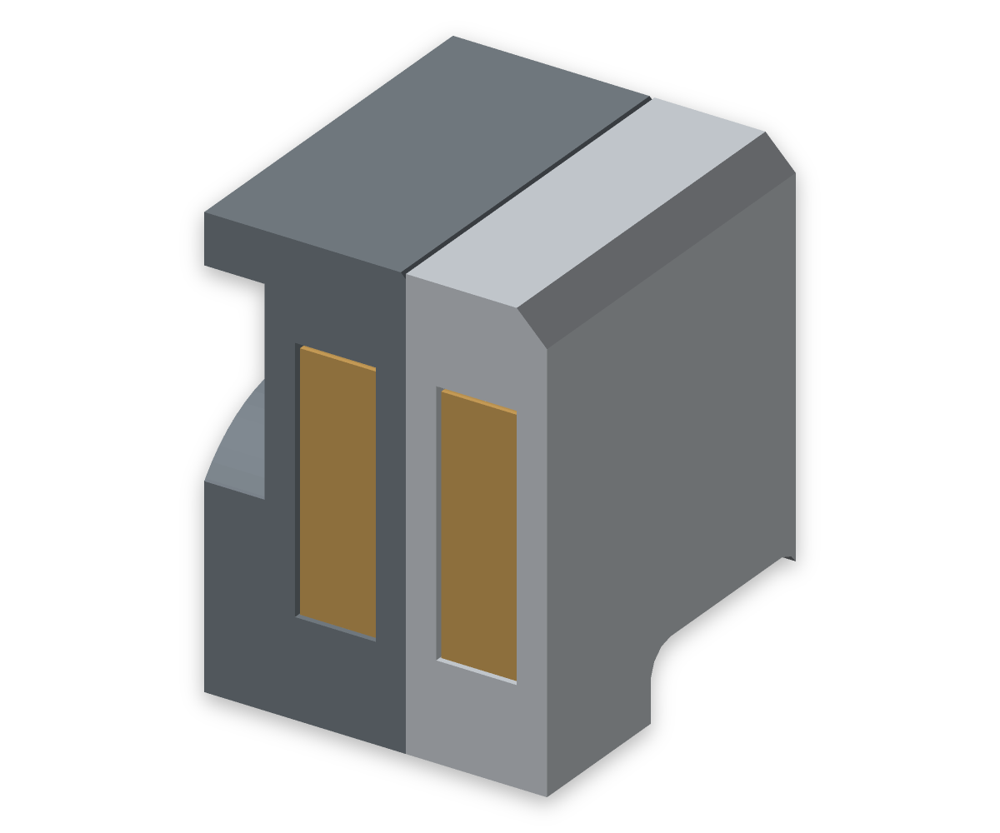
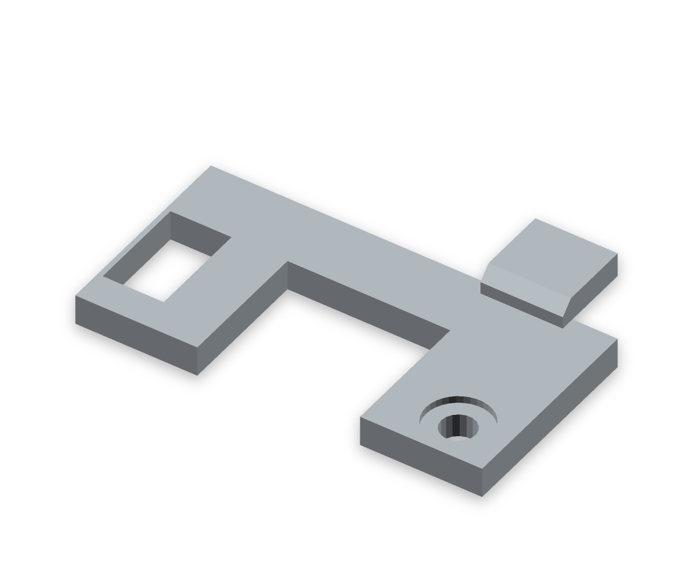

# FUMEX – Korrektur nach dem ersten Druck

Stand: 26. September 2026  
Modell-SHA256: `d2d21113b80c1214a133452ce8b9820178cb5de3a1354b2a165ddce98acb4137`

## Ergebnis und benötigte Teile

Die Lüfterkabeldurchführung ist vergrößert und nach hinten geöffnet. Alle acht Magnete werden jetzt während des Drucks eingelegt und vollständig eingeschlossen, mit **1,2 mm Kunststoff auf beiden axialen Seiten**. Neu zu drucken sind **Kopf, Kassette und Rückdeckel**. Die Base und das Filterkreuz können weiterverwendet werden.

Die Kopf-Ansaugplatte ist nun 5,6 mm dick. Filter, Stützkreuz und Lüfter sitzen innen 2,4 mm weiter hinten; die vier Rückdeckelpfosten werden entsprechend kürzer. Dadurch bleiben der volle Filterraum und der 5-mm-Abstand zwischen Kreuz und Lüfterrahmen erhalten. Ein bloßes Ansetzen von vier Magnetböden nach innen hätte stattdessen die Filterecken gedrückt. Die Außenmaße des Kopfs bleiben unverändert, die Kassette wird von 4,5 auf 5,6 mm dicker.

## Magnete und Druckpausen

- Acht geschlossene Kavitäten Ø10,3 × 3,2 mm für nominell Ø10 × 3 mm große Magnete.
- In beiden Drucklagen: Taschenboden bei Z1,2, Taschenende bei Z4,4 und Teilwandende bei Z5,6 mm.
- Das Projekt-3MF enthält auf **Platte 1 „Head“ und Platte 3 „Cassette“** jeweils eine Pause **vor der 4,6-mm-Schicht**, bevor diese die vier Kammern schließt. Das gilt für das enthaltene 0,2-mm-Schichtprofil; nach Änderung der Schichthöhe die Pausenposition erneut prüfen.
- Vorher denselben Pol auf allen acht Magneten markieren. Auf beiden Platten jeweils vier Magnete **mit der Markierung nach oben** einlegen; in Einbaulage stehen sich dadurch anziehende Pole gegenüber.
- Jeden Magneten flach auf den Taschenboden setzen. Ein 3-mm-Magnet endet bei Z4,2, also 0,2 mm unter dem zuletzt gedruckten Rand. Erst dann fortsetzen. Kleber ist nicht erforderlich.
- Die beiden sichtbaren Kunststoffhäute ergeben 2,4 mm Wand zwischen den Paaren; mit dem modellierten axialen Spiel beträgt der Abstand der auf ihren Druckböden liegenden Magnete 2,6 mm. Eine reale Abzugskraft ist nicht gemessen.

**Die Pausen stecken im [Projekt-3MF](../stl/fumex_all_parts.3mf), nicht in den STL-Dateien.** Auch einzelne Diagnose-3MFs unter `build/` sind keine Druckvorlage mit diesen Pausen.

## Kabeldurchlass

Der neue U-Ausschnitt ist **16 × 13,3 mm** groß und reicht bis zur offenen Rückseite des Kopfs. Die benachbarte erste Lüftungsöffnung entfällt; zur nächsten bleiben 5,5 mm Boden stehen. Die übrigen fünf Schlitze bleiben an ihrer ursprünglichen Position, mit 3,3 mm Material bis zum hinteren Bodenrand.

Bei der Montage die auf dem Lüfter befestigte Rückwand noch etwa 40 mm zurückhalten, den Stecker in die Base führen und das Kabel in die offene Aussparung legen. Erst danach Lüfter und Rückwand einschieben. So muss kein Stecker durch ein bereits geschlossenes Gehäuse gefädelt werden. Schraubensitz und Auflagering neben dem Ausschnitt bleiben vollständig erhalten.

Der geprüfte kontinuierliche Einlegeweg verwendet eine **angenommene** Steckerhülle von 14 × 8 × 16 mm, mit mindestens 0,65 mm geometrischem Abstand. Der anschließende 8 × 4 mm große Kabelkorridor bleibt auch während des Einschiebens frei. Der tatsächliche Arctic-Stecker und der flexible Verlauf bis zum Kabelauslass sind nicht vermessen.

## Korrektur der bisherigen Prüfung

Beim alten Kopf waren sowohl Frontplatte als auch Magnettaschen 3,2 mm tief: Die Taschen hatten dadurch keinen durchgehenden Boden. Die bisherigen Proben erfassten nur die radialen Seitenwände. Auch der zu kleine Kabeldurchlass war ohne Steckerweg als plausibel eingestuft worden. Diese beiden Aussagen des [vorherigen Audits](preprint-audit-2026-09-25.md) werden durch die reale Druckrückmeldung und die neuen Prüfungen korrigiert.

Die neuen Proben untersuchen alle acht Kavitäten, beide vollflächigen axialen Wände, die ebenen Anschläge, Magnetlage sowie Kabelöffnung und Steckerweg am exportierten Netz. Als Gegenprobe fallen die alten Kopf- und Kassettennetze durch; die alte Kabelöffnung blockiert die neue Mindestöffnung mit 232,255 mm³. Geschlossene Hohlraumschalen werden jetzt korrekt von getrennten Materialkörpern unterschieden. Diese allgemeine Werkzeugkorrektur ist im gemeinsamen Skill als `9fedfc0` übernommen und mit 13 Regressionen sowie der vollständigen Projektvorlage geprüft.

## Freigabeprotokoll

- **Export:** zehn gültige Drucknetze mit jeweils einem Materialkörper; Kopf und Kassette enthalten zusätzlich je vier korrekt orientierte Kavitätsschalen. 431 koaxiale Merkmals-Paare und alle zehn regulären Montagewege bestanden. 561 mögliche Körperpaare ergeben nach 29 begründeten Ausnahmen 532 allgemeine Kollisionsprüfungen.
- **Detailproben:** alle acht Magnetkavitäten und Vollhäute bestanden. Beide kontinuierlichen Steckerwege frei; fünf hintere Stege gemessen jeweils 3,300 mm. Alle vier verkürzten Lüfterauflagen samt Insertwänden und Blindböden vollständig. Lokale Mattenberührungen bleiben auf die bisherigen Schraubenzonen begrenzt.
- **Druckbarkeit:** Inseln, Überhänge, Wanddicke und freistehende dünne Stege jeweils CLEAN im regulären Prüflauf. Zehn einzelne Teile, alle fünf Produktionsplatten und die USB-Testplatte ohne Slicerwarnungen, Supports deaktiviert.
- **Pausen:** Die unabhängige [G-Code-Auswertung](fan-cable-magnets-2026-09-26/gcode-pauses.json) findet bei allen acht Taschen Bodenbahnen bis Z1,2, keine Überdeckung zwischen Z1,4 und Z4,4 und die erste Deckbrücke bei Z4,6. Auf beiden Platten steht die Pause vor der ersten Extrusion dieser Lage.
- **Material/Zeit:** 491,4 g und 16,5 h für die fünf angeordneten Produktionsplatten; 491,7 g und 17,4 h als Einzeljobs. Die neuen drei Teile einzeln: Kopf 225,6 g, Kassette 60,8 g, Rückdeckel 59,3 g. Zeiten enthalten keine manuelle Wartezeit beim Einlegen.
- **Nachweise:** [Exportbericht](fan-cable-magnets-2026-09-26/verification.json), [Slicerbericht](fan-cable-magnets-2026-09-26/slicer-summary.json), [Geometrievergleich](fan-cable-magnets-2026-09-26/change-scope.json), [Negativkontrollen](fan-cable-magnets-2026-09-26/regression-controls.json), [Dateiprüfsummen](fan-cable-magnets-2026-09-26/manifest.json). Das bisherige Generic-PETG-Profil bleibt unverändert; die im vorigen Audit beschriebene Auswahl eines passenden Profils für die tatsächliche XPETG-Rolle gilt weiterhin.
