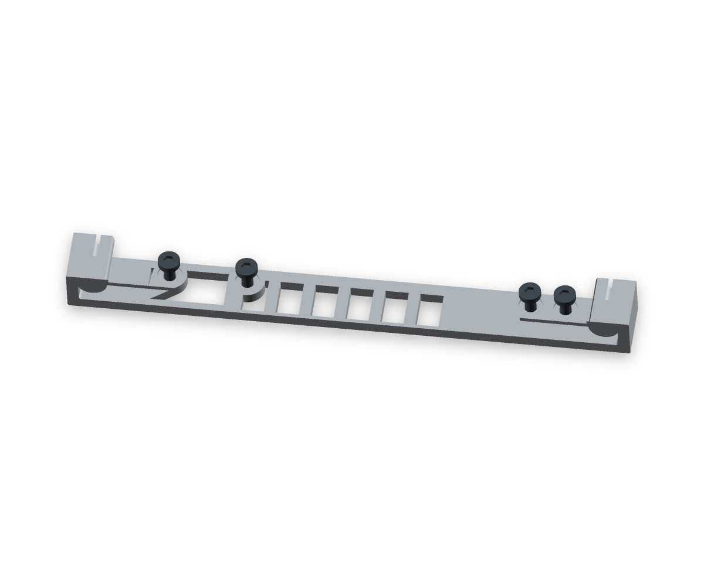

# Mount and control updates — 2026-09-23

Source SHA-256: `ef984926c92907ff6b44ab8dca544594ecc9b8692bdbae2d17ccce483a763e5b`.

| Request | Final construction |
|---|---|
| Remove the lid finger dish | Both duplicate cutters and their parameter are removed. The ballast lid has a plain top in that area. Its two M3 × 8 / Ruthex fasteners remain. |
| Use 45° supports for the USB-C PD module | Two gussets grow from the back wall, with at least 9.02 mm clearance above the trough floor. The existing rear-open lid slots pass around them. The gussets reach just below the lid to close those slots against loose ballast. |
| Four head-to-base screws | Four M3 × 8 screws with Ruthex RX-M3x5.7 inserts, at x25/45/118/127 and y66. Two pairs occupy the accessible rear row. Every screw has a complete bearing seat and checked tool access. |
| Second LED holder | A second blind Ø3.2 mm pocket at x80/z21 sits 8 mm beside the existing x88/z21 pocket. Both retain closed 0.8 mm front skins and inside flange seats. No electrical function is assigned to the additional holder. |
| More room for the PWM tab | Clearance is 0.4 mm per side, previously 0.2 mm. The anti-rotation-tab cut-out is now 2.9 mm wide instead of 2.5 mm. |
| Smaller knob | Diameter reduced from 28 to 26 mm; the shaft fit, internal sleeve and installed depth remain unchanged. |

## Geometry and assembly

All four head fasteners have 2.4 mm of bearing material, 5.6 mm screw penetration and 1.4 mm to the insert-pocket bottom. Each seat's material and closed-rim probes are fully filled, and each screw makes contact under a 0.05 mm seating displacement. The 0.6 mm shallow counterbore has a 0.8 mm rear lip; the load-bearing material below it remains complete. The left seat has a sloping connection to the cable-opening edge so it grows from existing material during printing.

The front filter tube leaves only about 4 mm above a possible front-row screw head. The four rear-row positions retain straight bit access without relying on unknown dimensions of the user's compact Wera ratchet. Existing charger air passages and the loaded lid's 10 mm vertical lift remain clear.

The USB gusset undersides measure a slope of −1 in Y/Z on both sides, corresponding to 45°. Their lower air volumes are empty, their upper load paths are continuous, and the PCB still bears on its rear seat. Both LED skins measure 0.8 mm; both nominal LED envelopes have the checked 15 mm inside-access path.

## Final checks and artifacts

- Eight closed print types, eleven physical pieces, 374 coaxial feature pairs and 496 assembly pairs pass. Nine standard sampled paths plus the combined LED-access path pass.
- Islands, overhangs at the standard 100 mm² threshold and fins are CLEAN. Thickness reports exactly the two intentional 0.8 mm LED windows; the 1.2 mm threshold is unchanged elsewhere. Head sampling retains the known Trimesh numerical warnings, with 65,204 usable samples out of 65,404.
- All eight individual parts and all four arranged plates slice with supports disabled and **no warnings**. The previous head floating-cantilever warning is gone.
- Arranged plates: **472.3 g / 15.5 h**. Individual jobs: **472.8 g / 16.5 h**.
- Ballast capacity: **42.42 cm³**, approximately **199 g** at the assumed packing density. Estimated assembly mass: **1019.3 g**; front margin **28.9 mm**, tipping angle **21.7°**.
- STLs, project 3MF, all nine documentation views and both viewer copies are rebuilt. Source/STL/slicer/3MF hashes agree; `build/viewer.html` and `docs/index.html` are identical.

[Verification report](verification.json), [slicer report](slicer-summary.json), and [archived evidence](mount-updates-2026-09-23/evidence.json). The evidence directory also contains the final build logs. The shared skill's screw-seat pitfall was updated in commit `6c9b8ec`; project scripts remain identical to the skill.

The loaded lid's complete extraction sequence remains unproven beyond its checked 10 mm lift. Physical fit, LED visibility, strength, thermal performance, airflow and flexible filter behaviour still require checks on the real assembly. The open viewer tab needs a manual reload because automated access to its local-file URL was blocked by the browser security policy.
