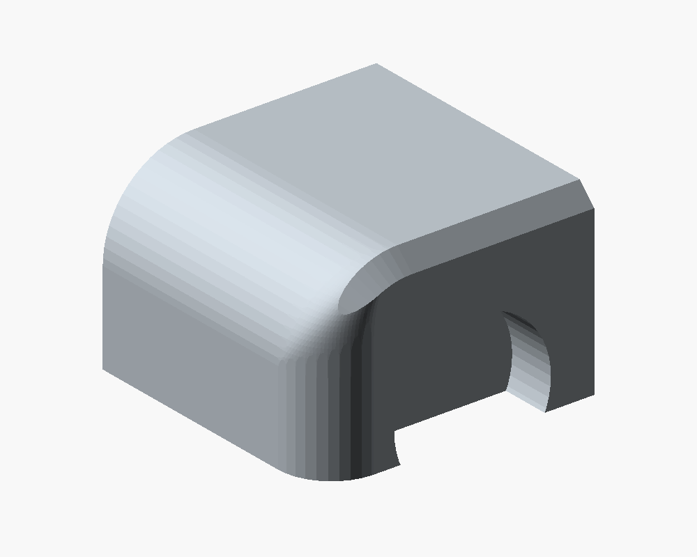
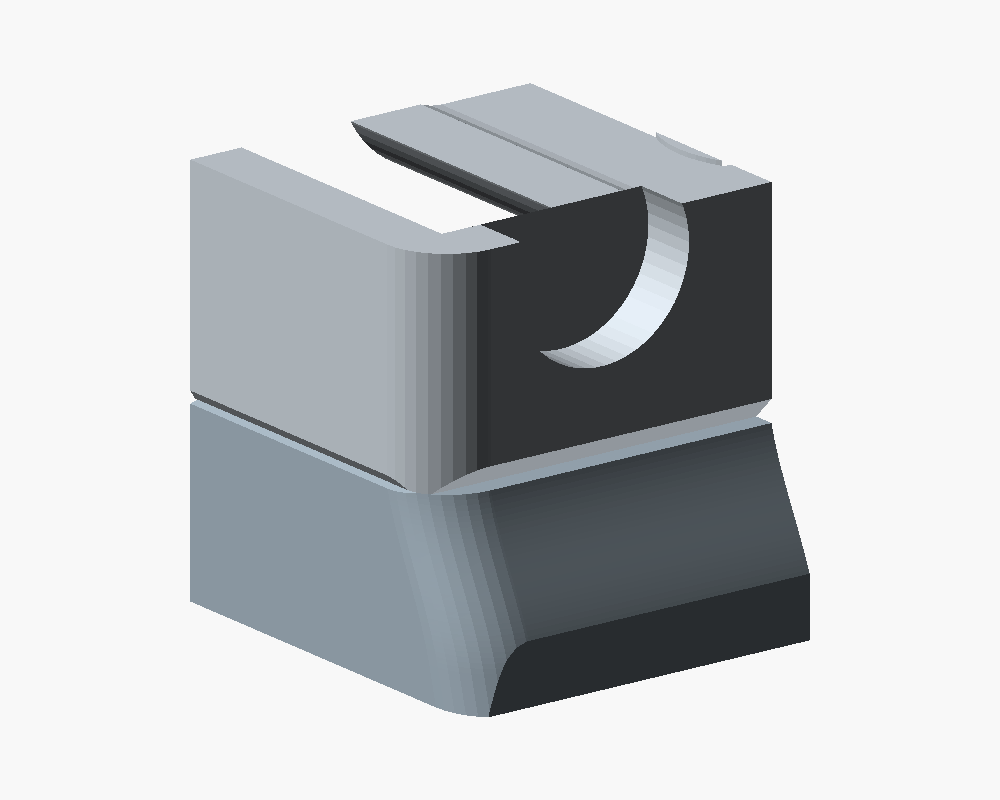

# FUMEX – Audit vor dem Druck

> **Korrektur nach dem realen Druck, 26.09.2026:** Der Nutzer hat fehlende Rückwände der Kopf-Magnettaschen und einen zu kleinen Lüfterkabeldurchlass festgestellt. Dieses Audit hatte nur die radialen Magnetwände geprüft und keinen Steckerweg durch den Durchlass. Die damalige Bewertung deckt diese beiden Stellen nicht ab. Die konstruktive Korrektur und erweiterte Prüfung stehen im [Nachtrag](fan-cable-magnets-2026-09-26.md).

**Stand: 25. September 2026 · geprüfter Commit: `4a11856`**  
Modell-SHA256: `152bdde96866f33b4eff4f85b12d2b582b43e39602d3c16a702fa8b487168946`

**Ergebnis: Kein neuer geometrischer Druck- oder Montageblocker gefunden. Die aktuelle Konstruktion ist für den nächsten Prototypendruck plausibel. Das ausgelieferte 3MF sollte mit deinem extrudr XPETG aber erst nach Wahl eines passenden Filamentprofils neu gesliced werden: Es enthält weiterhin 255 °C für Generic PETG.**

Das Audit verändert weder Modell noch Druckprofile. Es prüft die aktuellen STL-/3MF-Dateien, deren Übereinstimmung mit dem unmittelbar zuvor vollständig geprüften Export, zusätzliche Montageproben, kleinere Überhänge, kritische Wandbereiche und die sichtbare Form. Die identischen Slices wurden nicht unnötig wiederholt. Die Referenzberichte sind für diesen Stand als [Exportprüfung](preprint-audit-2026-09-25/verification.json) und [Slicerprüfung](preprint-audit-2026-09-25/slicer-summary.json) eingefroren; Dateiprüfsummen stehen im [Manifest](preprint-audit-2026-09-25/manifest.json).

## Vor dem Druckstart

| Punkt | Bewertung | Konkrete Konsequenz |
|---|---|---|
| **F1 – XPETG-Profil** | Vor dem Druck korrigieren | Materialfamilie PETG beibehalten, für die tatsächlich eingelegte XPETG-Rolle jedoch ein passendes Temperatur-/Kühlprofil wählen und neu slicen. |
| **F2 – USB-Passung** | Vor dem großen Base-Druck prüfen | Den vorhandenen kleinen USB-Passtest mit der echten Platine, Buchse und angelöteten Kabeln verwenden. Die Geometrie passt zur gemessenen Hülle; die obere Haltenase ist nicht gegen jedes reale Bauteil auf der Platine abgesichert. |
| **F3 – Knappe reale Passungen** | Beim ersten Zusammenbau prüfen | Werkzeug, PWM-Platine und beladener Deckel haben stellenweise nur etwa 0,2–0,3 mm modelliertes Spiel. Das berücksichtigt keine Druckabweichungen oder frei liegende Kabel. |
| **F4 – Betrieb und Wärme** | Vor längerem Betrieb prüfen | Lüfter/Filter auf Schleifen und Ladeelektronik im geschlossenen Gehäuse auf Erwärmung prüfen. Die bekannten Leistungs- und Temperaturgrenzen sind durch CAD-Prüfungen nicht erledigt. |

### F1: Das 3MF ist geometrisch aktuell, das Filamentprofil passt noch nicht zur gewählten Rolle

Beide PETG-Slots verwenden tatsächlich `Generic PETG @BBL H2S`. In `Metadata/project_settings.config` stehen **255 °C für erste und weitere Schichten**, **70 °C auf Textured PEI**, **12 mm³/s** Volumenlimit und **40–90 %** normale Bauteilkühlung. Vorhandener Diagnose-Gcode bestätigt die Temperatur mit echten Heizbefehlen; es handelt sich nicht nur um einen falschen Profilnamen.

Extrudr empfiehlt für XPETG Matt **210–240 °C**, **60–90 °C Bett**, **20–50 % Kühlung** und höchstens **12 mm³/s**. Bett und Volumenlimit passen; Temperatur und obere normale Kühlung weichen ab. Die Herstellerwerte sind ein Ausgangspunkt für das passende Profil, keine Garantie für die konkrete Rolle oder jeden Brückenbereich. [Extrudr, aktuelle Materialangaben](https://www.extrudr.com/en/gb/products/xpetg-matt/).

Die Einstufung als **PETG im AMS bleibt richtig** und ist von diesen Druckparametern getrennt. Das Audit erfasst die exportierten Dateien, nicht eventuell bereits abweichende Einstellungen in deinem offenen Bambu Studio. Die graue Rolle wurde dabei nicht als XPETG identifiziert; nur die tatsächlich damit belegten Slots entsprechend einstellen. Das 3MF enthält kein ausführbares Gcode und muss ohnehin gesliced werden. Die folgenden Gewichts-/Zeitangaben gelten für das bisherige Generic-PETG-/TPU-Profil.

## Geometrie und sichtbare Übergänge

Die Gesamtform wirkt weiterhin zusammengehörig: senkrechte Base, nach vorne geneigter Kopf, bewusst aufgesetzte Kassette, innenliegende Füße und eine ruhige Außenfläche. Die letzten Änderungen bleiben im Innenraum. Die neue Verbindung zwischen Akku-Anschlag und Wanne beseitigt einen freistehenden Wandabschnitt, ohne neue Außenkanten zu erzeugen.

- **Obere Kopfecken:** Der frühere Schnitt zweier Radien mit etwa 38° Normalensprung ist ersetzt. Die unabhängige Wiederholung der Eckprüfung findet an Kopf und Rückdeckel maximale benachbarte Facettenwinkel von **6,11–7,83°**, keine Kantenlänge oberhalb der Prüfgrenze. Das sind tessellierte Rundungen, keine mathematisch glatte STL-Oberfläche.
- **Kopf-/Base-Fuge:** Der frühere rund 1,26 mm breite Versatz wurde durch den 8 mm hohen Übergang ersetzt. Der beabsichtigte 15°-Knick, die Trennfuge und ihre Fasen bleiben sichtbar. Die gemeldete Spannendifferenz von etwa 0,408 mm stammt aus Schnitten **2 mm ober- und unterhalb** der Fuge; sie ist kein gemessener 0,408-mm-Spalt und kein Beweis vollständiger Tangentenstetigkeit.
- **Fasen:** Die fertigen Konturen werden mit BOSL2 verrundet beziehungsweise gefast. Die vorhandenen Profilprüfungen messen die tatsächlichen Exportkanten; die früher abgeschnittene seitliche Kassettenfase ist nicht wieder aufgetreten. Die bewussten Funktionskanten an Schraubensitzen, Griffmulden und Steckführungen bleiben.
- **Frontbefestigung:** Zusätzliche Querschnitts-/Materialproben finden keine früheren dünnen Resthäute vor den erhöhten Schraubdomen. Erhaltene Frontwand und der geschlossene Ring unter den Kappen sind vollständig vorhanden.
- **Magnettaschen:** Die geprüften radialen Materialringe von 1,21 mm bleiben erhalten. Reale Magnetmaße und Klebehalt sind weiterhin eine Passprobe.

[Zusätzliche Oberflächenmessungen](preprint-audit-2026-09-25/surface-evidence.json), [linker Frontschnitt](preprint-audit-2026-09-25/front-root-section-x25.5.svg) und [rechter Frontschnitt](preprint-audit-2026-09-25/front-root-section-x119.5.svg).

| Obere Ecke am exportierten Netz | Fuge zwischen Kopf und Base |
|---|---|
|  |  |

Die Ausschnitte sind zur Prüfung aufgeschnitten; die großen offenen Schnittflächen sind keine zusätzlichen Öffnungen am Bauteil.

## Montage und Befestigungen

| Bereich | Ergebnis am aktuellen Modell | Grenze der Aussage |
|---|---|---|
| Akku längs | Rechts 0,50 mm Nennspiel; linker Anschlag greift bei ungefähr 0,85 mm. Beide Seiten in neun verschobenen/angehobenen Lagen geprüft. | Schrumpfschlauch, tatsächliche Kabel und Drucktoleranzen sind nicht vollständig modelliert. |
| Akku nach oben | Zwei geschlossene Kabelbinder über den vorhandenen Bodenschlaufen; etwa 2,71 mm Abstand zum Kopf. 150-mm-Binder haben rund 29,55 mm Reserve für Verschluss und Ende. | Die Binder liegen direkt über dem gesamten Pack einschließlich BMS. Nur handfest anziehen; keine Druckentlastung der Elektronik behauptet. |
| Neuer Anschluss zur Wanne | 3 mm breiter, durchgehend am Boden angebundener Steg. Material über dem ehemaligen Spalt und in beiden Anschlüssen vollständig vorhanden. | Zur Deckelvorderkante bleiben diagonal 0,283 mm, vertikal über der Wannenwand 0,4 mm. Festigkeit und Kriechen wurden nicht physisch gemessen. |
| Wannendeckel | Genau zwei M3×8 in Ruthex-Inserts. Vollständiger Ausbau mit montiertem Lademodul, Kühlkörper und Binder besteht; nach dem ersten Hub mindestens 0,20 mm Abstand. | Kopf, Akku, Schalter und Deckelschrauben vorher entfernen; Kabelschlaufen müssen den beschriebenen Weg mitmachen. |
| USB-PD-Modul | Offener Einbauweg, mittiger unterer Anschlag und obere Sicherung. Einsetzen zusätzlich mit bereits montiertem PWM, Poti und LEDs kontinuierlich geprüft. Beide Kabelseiten bleiben frei. | Die gemessenen 4,3 mm beschreiben die Modulhülle einschließlich Bestückung. Tragfähige, bauteilfreie Kontaktfläche unter der oberen Nase am Original prüfen. |
| Kopf auf Base | Vier M3×8 mit direkter Gegenauflage, zwei vorne und zwei hinten, alle gleich nach unten. Je Schraubenkopf etwa 16,44 mm² Auflage. Vorne 1,6 mm tragender Sitz, 6,4 mm Eindringtiefe und 0,6 mm Bodenreserve. | PETG-Klemmkraft, Insert-Auszug und Langzeitkriechen sind keine rein geometrischen Eigenschaften. |
| Schraubenzugang | Frontweg der modellierten kleinen Ratsche mit 25-mm-Bit frei, begrenzter Schwenkweg mit mindestens 0,902 mm Reserve. | Wera-Maße sind angenommen. Hinten rechts hat der modellierte Schraubendreher lokal nur 0,325 mm Abstand zur Wand. |
| PWM-Platine | Zwei Bodenschrauben und ihre Auflagen stimmen. Zusätzliche Wegprüfung findet nach dem Freiheben mindestens etwa 0,192 mm im ersten Kippabschnitt. | Beim anfänglichen Hub schneiden zwei winzige Ecken der konservativen Anschluss-Hülle die Bosskanten, maximal 0,0000517 mm³. Das liegt unter der Prüftoleranz, ist aber kein absolut kollisionsfreier Nachweis für die reale Verkabelung. |
| Ladeplatine | Nur das kühle OUT-Ende gehalten; 4,7 mm Abstand zwischen Halter und Kühlkörper. Vorder- und Rückseite besitzen offene Luftwege. | Binderverlauf, Lötstellen und Kabel am echten Modul prüfen; freie Luftwege beweisen keine ausreichende Kühlung. |
| LEDs | Zwei geschlossene 1,8-mm-Fronthäute, 12 mm Mittenabstand, Einsetzen von innen möglich. | Sichtbarkeit durch anthrazitfarbenes XPETG ist ungeprüft. |
| Filterstütze | Verstärktes Kreuz sitzt in vier Aufnahmen und wird vom Lüfterrahmen gehalten. Zentral 5 mm Rahmenabstand, ungünstigster nominaler Anschlag 4,8 mm. | Den echten Rahmenkontakt aller vier Enden prüfen. Flexible Matte, lose Fasern und Biegung bleiben unmodelliert. |

**Poti-Achshöhe zusätzlich prüfen:** Die gemeinsame Messnotiz nennt nur ungefähr 6,0 mm über der PWM-Platine; das Modell verwendet 6,3 mm bei 0,2 mm radialem Buchsenspiel. Falls die echte Höhe genau 6,0 mm ist, wäre das nominelle Spiel um etwa 0,1 mm überschritten. Das ist eine konkrete Messunsicherheit, kein bestätigter Passungsfehler. Vor dem Festschrauben prüfen, dass die Platine flach auf beiden Bossen und den Auflagen liegt und das Poti frei sitzt.

Der Schnappmechanismus des Schalters und der Verschlusskopf des Ladeplatinen-Binders sind nicht vollständig modelliert. Den beladenen Deckel deshalb vor endgültiger Verdrahtung probeweise einsetzen und herausnehmen, einschließlich erreichbarer Schalterclips und tatsächlich platzierter Kabel/Binderköpfe.

Die örtliche Verformung der weichen Filtermatte über den vorderen Schraubenköpfen ist die ausdrücklich gewählte Lösung: maximal **2,75 mm**, auf zwei Bereiche begrenzt. Sie ist kein versehentlicher harter Teilekontakt. Die beiden früheren Akku-Auflagen sind auch im Druckprojekt vollständig entfernt.

Die Ballastwanne hat keine große offene Ecke mehr. Es bleiben konstruktive Fugen von ungefähr 0,25 mm seitlich beziehungsweise 0,4 mm über der Wand: grobe Metallreste werden zurückgehalten, feine Späne oder Metallpulver sind dadurch nicht zuverlässig eingeschlossen.

[Zusätzliche mechanische Proben](preprint-audit-2026-09-25/mechanical-probes.json).

## Druckbarkeit und Dateikonsistenz

| Prüfung | Ergebnis |
|---|---|
| Drucknetze | 10 gültige Netze: 8 Produktionstypen und 2 optionale USB-Testtypen; je ein geschlossener Körper, keine entarteten Dreiecke. |
| Tatsächliche Teilezahl | 11 Produktionsteile einschließlich 4 Füßen; keine Akku-Auflagen. |
| STL → 3MF | Rücktransformierte Netzkoordinaten stimmen innerhalb von 0,000006 mm überein; keine stillen Reparaturen. |
| Lage und Bauraum | Alle Teile in vorgesehener Drucklage auf Z0, innerhalb des H2S-Bauraums; nur Drehungen in der Plattenebene. Mindestens 2 mm Abstand zwischen Objekten. |
| Platten | Kopf/Deckel/Kreuz; Base/Rückdeckel; Kassette/Knopf; vier TPU-Füße. Separates 3MF für die zwei USB-Testteile. |
| Standardanalysen | Inseln, Überhänge, Wandstärke und dünne freistehende Stege ohne Befund bei den festgelegten Schwellen. |
| Zusätzliche Überhangprüfung | Bei 5 statt 100 mm²: 31 kleine Bereiche an den Produktionsteilen, 2 Wiederholungen im USB-Testboden. Keine neue freischwebende Geometrie. |
| Slicer | 10 Einzelnetze, 4 Produktionsplatten und USB-Testplatte ohne Warnungen und ohne Supports gesliced. |
| Prozess | 0,20 mm, 4 Wände, 5 Deck-/Bodenschichten, 20 % Gyroid; Kreuz und Füße 100 %. Jede Platte verwendet nur ein Filament. |
| Aktuelle Schätzung | 475,9 g / 15,8 h als angeordnete Platten; 476,3 g / 16,8 h als Einzeljobs. USB-Passtest etwa 10,0 g / 62 Minuten. |

Die kleinen Überhänge sind nicht wegdefiniert: Der größte ist die **10,75-mm-Brücke unter dem USB-Sitz** mit etwa 60 mm². Dazu kommen Griffmulden, kurze Führungsansätze, Tunnel, Insertdächer und Öffnungen. Sie sind supportfrei angelegt; ihre Unterseiten und Maßhaltigkeit am ersten Druck prüfen, besonders nach dem Wechsel zum XPETG-Profil.

Die Dickenanalyse ist eine Stichprobe mit Flächen- und Kantenfiltern. Beispielsweise bleiben am Kopf 65.253 gültige Messstrahlen von 65.414; einzelne numerische Strahlfehler sind bekannt. „Ohne Befund“ bedeutet deshalb nicht, dass jeder winzige Rand mindestens 1,2 mm dick ist. Die belasteten Schrauben-, Stop- und Halterbereiche werden zusätzlich separat geprüft.

**Prüfzahl präzisiert:** 34 Baugruppenkörper ergeben 561 mögliche Paare. Davon werden **533** regulär auf Kollision geprüft; **28** sind begründete Montagezustände oder beabsichtigte Kontakte. Kritische Ausnahmen für PWM-Schraubgewinde und flexible Matte sind zusätzlich begrenzt. Akku, USB und der neue Wannenanschluss besitzen keine pauschale Kollisionsausnahme. [Datei- und 3MF-Nachweise](preprint-audit-2026-09-25/artifact-evidence.json).

## Stabilität und Betrieb

Die bestehende Rechnung ergibt mit etwa 189 g Ballast **28,3 mm vordere Standreserve und 21,0° Kippwinkel** bei 1,013 kg. Eine zusätzliche Rechnung mit den aktuellen Slicer-Massen der Druckteile statt der pauschalen effektiven Dichte ergibt **27,5 mm, 20,2° und 1,090 kg**. Der Schwerpunkt bleibt deutlich innerhalb der geforderten 15-mm-Reserve; die veröffentlichte Massenschätzung ist aber rund 77 g niedriger als dieser alternative Ansatz. Beide Rechnungen verwenden vereinfachte Masseverteilungen und geschätzte Kaufteilmassen.

Mit halbem Ballast sinkt der Winkel im bisherigen Modell auf etwa 17,5°, ohne Ballast auf etwa 13,7°. Das ist eine Sensitivitätsrechnung, kein physischer Kipptest und keine Aussage über Zug am USB-Kabel. [Berechnung](preprint-audit-2026-09-25/tipping-sensitivity.json).

Die bekannte elektrische Reserve bleibt offen: Der P12 Pro PST ist mit **0,33 A bei 12 V** spezifiziert. Die Projektnotizen nennen für das LFUPSMA-Modul **0,32 A**; dessen reale Ausgangsleistung wurde in diesem Audit nicht neu gemessen oder unabhängig vom vorhandenen Modulnachweis bestätigt. Ein problemloser Dauerbetrieb bei Vollgas ist damit nicht nachgewiesen. [ARCTIC-Datenblatt](https://www.arctic.de/media/2c/de/c6/1750758983/Spec_Sheet_P12_Pro_PST_EN.pdf).

Die Luftkanalprüfung zeigt freie Wege auf beiden Seiten des Ladeboards, keine Temperaturmessung. XPETG-Materialkennwerte ersetzen diese Messung ebenfalls nicht; Extrudr nennt aktuell 67 °C HDT/B unter einer definierten Prüflast, keine pauschale zulässige Dauergebrauchstemperatur für diese dünnen Halter. [Extrudr](https://www.extrudr.com/en/gb/products/xpetg-matt/). Filter-Druckverlust, Absaugwirkung und tatsächliches Schleifen bei voller Drehzahl bleiben Funktionsprüfungen am aufgebauten Gerät.

## Praktischer Ablauf

1. In Bambu Studio das passende Profil für die tatsächlich eingelegte XPETG-Rolle wählen, Materialfamilie PETG lassen und neu slicen.
2. Zuerst den vorhandenen USB-Passtest mit echter Platine und Kabeln zusammenstecken: Einschub, oberen Halt und seitliche Kabelwege prüfen.
3. Danach die Base aus dem geprüften Stand drucken. Die letzte Verstärkung änderte ausschließlich ihre Produktionsgeometrie; die übrigen passenden Teile müssen dafür nicht neu gedruckt werden.
4. Beim Zusammenbau Binder nur handfest, knappe Wege ohne Gewalt und alle vier Filterstützen auf tatsächlichen Rahmenkontakt prüfen. Abschließend Lüfterlauf und Erwärmung im geschlossenen Aufbau testen.

Es ist derzeit keine weitere CAD-Änderung aus diesem Audit zwingend abgeleitet. Der offene Punkt vor dem XPETG-Druck ist das Profil; die restlichen genannten Grenzen betreffen Passung und Betrieb des realen Prototyps.
