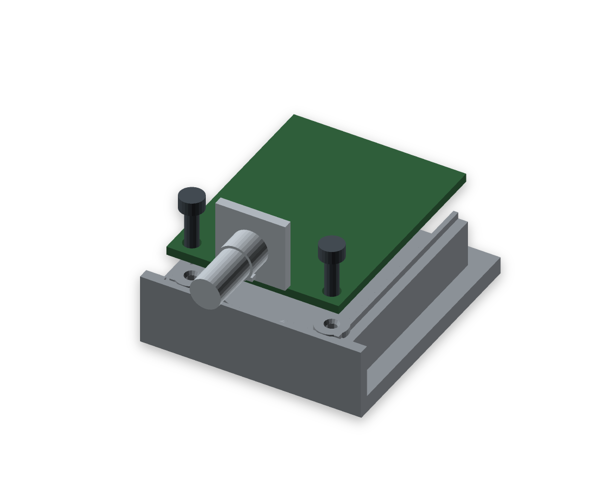

# PWM controller floor mounting — 2026-09-23

The PWM controller now fastens through its two front PCB holes into floor-connected bosses using the user's two 2.5 × 8 mm thermoplastic screws. There is no potentiometer nut or washer on the front. The knob diameter is 24 mm, down from 26 mm; shaft engagement and axial projection are unchanged.

## Dimensions and installation

| Feature | Result |
|---|---|
| PCB | 41.05 × 32 × 1.6 mm, shared measured hardware |
| Holes | Ø3.2 mm, centres 3 mm from front and side edges; 26 mm pitch |
| Screw heads | Flat underside, measured Ø4.5 mm; 2.5 mm height used as an unmeasured clearance envelope |
| Floor bosses | Ø6 mm, bearing plane z13.1; existing edge pads support the rear |
| Pilot | Ø2.0 × 7.4 mm, relieved mouth Ø2.7 × 0.7 mm |
| Screw penetration | 6.4 mm through the PCB, 1 mm reserve to the pilot bottom |
| Floor reserve | 2.5 mm above the 3.2 mm floor |
| Tool access | Slim shaft Ø4 mm for at least 25 mm above the head |

Install the PWM controller before the rocker switch. Tilt the PCB rear upwards, feed the shaft through the concealed front opening, and lower the board onto the bosses and edge pads. The opening and internal recesses allow 3.5 mm of upward movement for installation; the knob covers the opening. The PCB remains in its original position because the switch limits rearward relocation. Keep the knob as a removable press fit; the former mandatory CA-glue instruction is removed so the controller remains accessible.

The pilot is a starting value for printed PETG, inferred from the 0.8D relation in the [EJOT DELTA PT thermoplastic design guide](https://www.ejot.com/medias/sys_master/Industry_Flyer/Industry_Flyer/h11/hc7/9331662782494/EJOT-DELTA-PT-Flyer-08.23-en.pdf). The user's unidentified screws are not asserted to be EJOT. Confirm driving torque and retention on a printed sample. The measured head diameter and the user's clearance confirmation are used; head height remains unmeasured.

## Verification

- Eight closed print types, eleven pieces; 443 coaxial feature pairs and 528 assembly pairs pass. Intentional screw/pilot interference is restricted to the two thread-forming regions.
- Both boss bearing rings and PCB bearing rings are complete. Each screw head and each PCB seat passes an individual contact probe. Pilot depth, material around the holes, bottom reserve and driver access pass.
- Nine standard paths and the LED access path pass. The new complete PWM removal path additionally checks 465 lift/translation/rotation poses, including the actual anti-rotation tab. Maximum computed overlap is 0.000052 mm³, below the 0.01 mm³ numerical tolerance. Remove the head assembly, knob, both PCB screws and rocker switch first. Battery, loaded ballast lid, USB board and LEDs may stay. Both screws independently clear 60 mm vertically; the knob clears 20 mm forwards. Reverse the PCB path for installation.
- Islands, overhangs at the standard 100 mm² threshold and fins are CLEAN across all eight parts. Thickness reports only the two intentional 0.8 mm LED skins (sampled areas 20 and 12 mm²). The head retains its numerical ray warnings: 65,204 valid samples out of 65,404. This is not a global thickness or physical-fit guarantee.
- All eight individual parts and four arranged plates slice without supports and with no warnings. Arranged plates: **471.9 g / 15.6 h**. Individual jobs: 472.3 g / 16.6 h.
- Estimated assembled mass 1017.2 g; front tipping margin 29.0 mm, tipping angle 21.7°. Ballast capacity is unchanged.

The STL files, four-plate 3MF, ten documentation views and viewer are rebuilt. Mesh source SHA: `b21de4cee404bf7ec0729d4387ee1f67255d2660a494efb6897dea5861848cb0`.

Evidence: [full geometry report](verification.json), [slicer report](slicer-summary.json), [printability evidence](pwm-mount-2026-09-23/thickness.json). Wiring, print tolerances, screw strength and actual hardware fit require physical verification. Previously documented airflow, thermal and ballast-lid extraction limits remain.

The lofted-wall recess pitfall found while extending the installation clearance is recorded in the shared print skill (commit `e72f129`). Project scripts remain identical to the shared skill.
