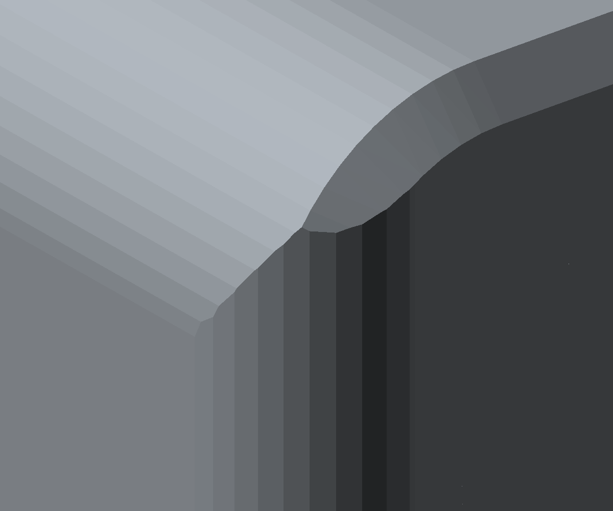
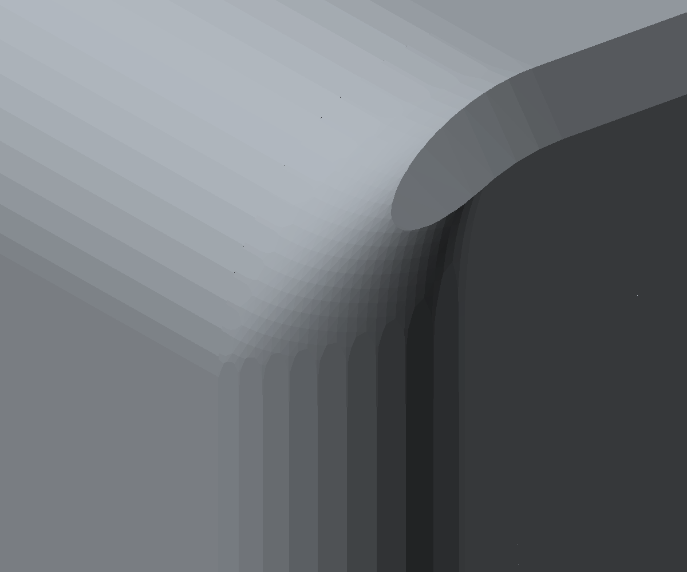
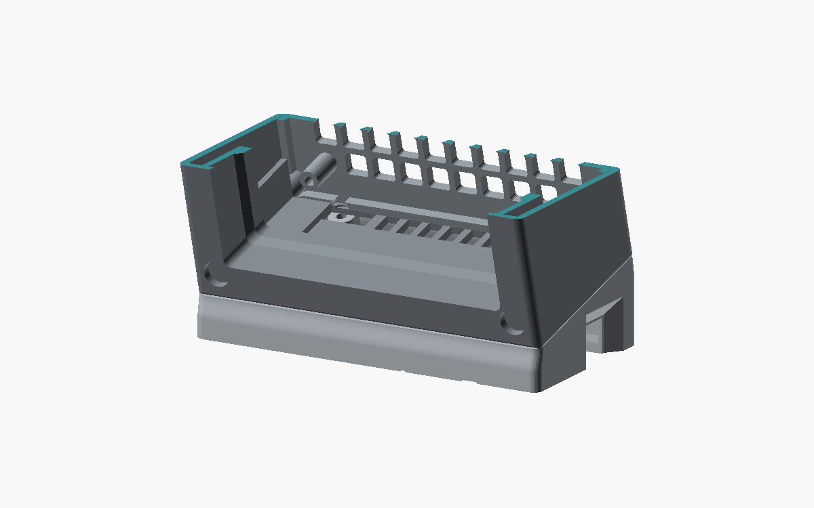
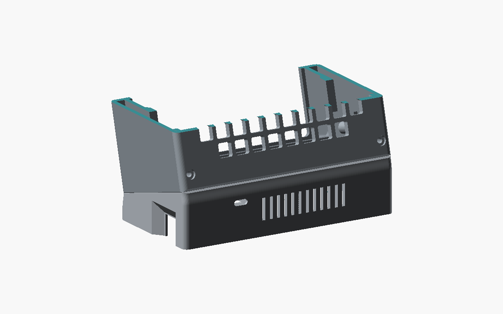

# FUMEX – Nachprüfung von G2 und G3

Stand: 23. September 2026. Ausgangspunkt: `3f53a15`, nach den ersten Auditkorrekturen.

**G2 und G3 sind jetzt konstruktiv behoben.** Die oberen Kopfecken haben einen räumlich geglätteten Übergang, und der Sockel folgt an der Fuge dem tatsächlich gekippten Kopfgrundriss. Radien, Magnetpositionen und Außenmaße bleiben erhalten. Der gewollte 15°-Gehäuseknick, die Trennfuge und die vorgesehenen Fasen bleiben sichtbar.

Diese Nachprüfung behandelt die beiden verbleibenden Geometriebefunde und deren Folgen für Montage und Druck. Sie ergänzt das [ursprüngliche Audit](audit-2026-09-23.md); sie ersetzt keinen realen Pass-, Temperatur- oder Luftstromversuch.

## G2 – obere Kopfecken

Der bisherige Schnitt von R3,5 im Grundriss und R6 im Aufriss erzeugte eine echte diagonale Formkante. Beide Radien dürfen bleiben: Nur ihr gemeinsames Eckfeld benötigt eine andere Fläche.

`top_corner_blends()` ersetzt dort das harte Maximum der beiden Kreisprofile durch einen glatten Übergang. Wo beide Profile wesentlich beitragen, folgt er `sqrt(a²+b²)`; zur unveränderten Kreisfläche läuft er mit einer glatten Funktion aus. Der analytische Übergang ist tangential stetig (C1). Das exportierte STL bildet ihn mit kleinen Dreiecksflächen ab. Die vorgesehene Randfase ist weiterhin eine Fase.

| Vorher | Nachher |
|---|---|
|  |  |

Die Änderung entfernt jeweils etwa **1,8 mm³** aus Kopf und Rückwand. An allen vier Magnettaschen ist ein vollständiger radialer Materialring von **1,21 mm** über nahezu die gesamte Taschentiefe nachgewiesen. Die Magnettaschen bleiben Ø10,3 × 3,2 mm.

Die zusätzliche Regression prüft die Normalensprünge im betroffenen Außenflächenbereich:

| Ecke | Maximale Änderung zwischen benachbarten relevanten STL-Flächen |
|---|---:|
| Kopf vorn links | 6,55° |
| Kopf vorn rechts | 7,83° |
| Rückwand oben links | 6,11° |
| Rückwand oben rechts | 6,54° |

Das alte Modell scheitert an derselben Prüfung an allen vier Ecken mit etwa **44–46°**; der Grenzwert beträgt 15°. Die verbleibenden kleinen Änderungen sind die Facettierung der Rundung. Numerische Dreiecksstreifen unter 0,001 mm Höhe werden bei diesem Normalentest ausgeklammert; geschlossene Netze und entartete Dreiecke werden davon unabhängig geprüft. Der Test ist gezielt auf diese frühere Schnittkante begrenzt und kein Zertifikat für sämtliche Oberflächen des Modells.

## G3 – Sockelfuge

Die frühere Lippe entstand durch die Projektion: `37 × (1 − cos 15°) = 1,260744 mm` je Stirnseite. Ein gleicher Grundriss in zwei verschieden orientierten Koordinatensystemen reicht deshalb nicht für eine bündige Fuge.

Die oberen **8 mm des Sockels**, senkrecht zur Fuge gemessen, laufen jetzt in 32 Abschnitten weich auf den projizierten Kopfgrundriss zu. Der Anschluss an die unveränderte Sockelwand bekommt dadurch keinen zusätzlichen Absatz. Die Innenkontur folgt mit einer kleinen Wandreserve und beginnt ihre Verjüngung etwas früher. Gezielte Normalmessungen im neuen Frontwandbereich ergeben mindestens **2,999 mm**, entsprechend nominal 3 mm innerhalb der Netzgenauigkeit.

| Vordere Fuge, Ausschnitt | Hintere Fuge, Ausschnitt |
|---|---|
|  |  |

Die Bilder zeigen bewusst angeschnittene Gehäuseteile. Die farbigen Schnittflächen sind keine zusätzlichen Bauteile.

**Die Fuge bleibt ein gewollter 15°-Knick.** Behoben ist die vorstehende Sockellippe; ein tangentialer Übergang vom senkrechten Sockel zum geneigten Kopf war nicht das Konstruktionsziel. Auch die rückseitigen Fasen und der 0,3-mm-Abstand der Rückwand bleiben bestehen.

Die neue Innenkontur erforderte eine Montagekorrektur: Die hintere Reihe der Ballastdeckelschrauben samt Posts liegt jetzt bei **y = 66,2 statt 67,5 mm**. Damit kommt der bestehende Ø6,35-mm-Torx-Bit an der Rückwand vorbei. Zwischen benachbarten Kopftaschen bleiben 1,3 mm Material. Die Deckelgeometrie, Schrauben und Werkzeugkörper folgen derselben Positionsfunktion.

Eine zweite Regression vergleicht echte Netzsilhouetten an fünf Stellen über die Gehäusebreite, jeweils 2 mm unter und über der Fuge. Die frühere überschüssige Sockeltiefe von **2,58–2,61 mm** fällt auf **0,403–0,408 mm**. Dieser Rest gehört zum noch laufenden Übergang unterhalb der Fuge. Der Test prüft die Schulter und ihre gerundeten Enden; er behauptet keine Tangentialität über den Gehäuseknick hinweg.

## Prüfung des integrierten Modells

| Prüfung | Ergebnis |
|---|---|
| Drucknetze | 7 Typen, 10 Teile; alle geschlossen, jeweils 1 Körper, 0 entartete Dreiecke |
| Bettlage und H2S-Bauraum | bestanden |
| Baugruppen | 435 Paare geprüft, keine unerlaubte Überschneidung oberhalb der Prüftoleranz; 14 dokumentierte Ausnahmen für Montagezustände und gewollte Passungen |
| Rundfeature-Ausrichtung | 394 koaxiale Paare |
| Montagewege | alle 8 bestanden, einschließlich zusammengebautem Lüfter/Rückwand-Paket |
| Werkzeugzugang | vorhandene Bit- und Halterhüllen kollisionsfrei im jeweiligen Montagezustand |
| Inseln / Überhänge / Wanddicke / dünne freie Stege | jeweils CLEAN für alle 7 Netze |
| Slicer | alle 7 Einzelteile und alle 4 Projektplatten bestanden, Stützen ausgeschaltet |
| Standfestigkeitsmodell | 1008,4 g geschätzte Gesamtmasse, 28,6 mm vordere Reserve, 21,4° Kippwinkel |
| Druckaufwand | 470,5 g und 15,4 h auf den vier Projektplatten; 470,9 g und 16,1 h als einzelne Teilejobs |

Die Basis verwendet den vorhandenen CGAL-Exportfallback, weil der schnelle Backend-Export numerische Kleinstfacetten erzeugt. Das endgültige binäre STL ist gültig; es wurde nicht nachträglich repariert. Die Projektwerkzeuge in `scripts/` bleiben unverändert und identisch zum Skill.

**Verbleibende Druckhinweise:** Bambu meldet wie bereits vor dieser Änderung bei `base` und `head` „floating cantilever“, auch auf den entsprechenden Projektplatten. Die geometrischen Analysen finden bei ihren dokumentierten Schwellen keine unzulässigen Bereiche. Das ist keine Garantie für perfekte Brücken am echten Drucker: Die kleinen Taschen, Laschen und Öffnungen bleiben beim ersten Druck zu kontrollieren. Die Meldungen wurden weder unterdrückt noch als behoben ausgegeben.

Unverändert offen sind die realen Magnetmaße und Haltekraft, Knopfpassung, angenommene Hardwaremaße, tatsächlich gewogene Massen sowie thermisches Verhalten und Filterwirkung. Die neue Geometrieprüfung kann diese Versuche nicht ersetzen.

## Nachweise

- [Vollständiger aktueller Prüfbericht](verification.json) mit den neuen Eck- und Fugenproben.
- [Regressionen mit alter und neuer Geometrie](rounding-2026-09-23/regressions.json).
- [Slicerbericht](slicer-summary.json) mit Warnungen, Einstellungen, Material und Zeiten.
- [Export- und Analyselogs](rounding-2026-09-23/results.json).
- [Ergänzende lokale Wand- und Montageproben](rounding-2026-09-23/g3-prototype-evidence.json); die finalen integrierten Netze sind im vollständigen Prüfbericht erfasst.
- [Aktualisierter 3D-Viewer](index.html) und [Bambu-Projekt](../stl/fumex_all_parts.3mf).

Die Vorher-/Nachher-Render wurden visuell verglichen. Die neue Eckfläche entfernt die diagonale Schulter, während der funktionale, geknickte Gehäuseaufbau erhalten bleibt. Die dazugehörigen Regressionen schlagen mit der alten Geometrie fehl und bestehen mit dem aktuellen Export.
